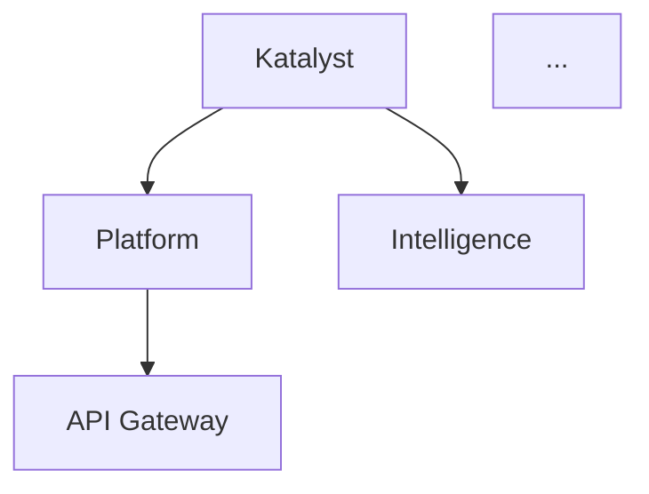

# ROAD-029 Implementation Guide

**Lifecycle-Oriented Navigation + System Taxonomy**

## Overview

This guide provides step-by-step instructions for implementing ROAD-029, which reorganizes the Katalyst Delivery Framework navigation into lifecycle stages and adds a comprehensive System Taxonomy section.

## Quick Reference

- **ROAD Item**: ROAD-029
- **Status**: Proposed → ADR Validated → BDD Pending → Implementation
- **Phase**: 4 (Visualization)
- **Priority**: High
- **Estimated Effort**: 3 days
- **Dependencies**: None

## Implementation Checklist

### Day 1: Create Taxonomy Documentation

#### Step 1.1: Create Directory Structure
```bash
cd packages/delivery-framework
mkdir -p taxonomy
```

#### Step 1.2: Create Taxonomy Files (6 files)

Create these files in `taxonomy/`:

**1. `index.md` - Overview**
- What is System Taxonomy?
- Navigation guide to other taxonomy docs
- FQTN (Fully Qualified Taxonomy Names) introduction
- Link to API integration (future)

**2. `org-structure.md` - Organizational Structure**
- Organizational chart (can use Mermaid diagram)
- Team → System ownership mapping
- Contact information for system owners
- RACI matrix (Responsible, Accountable, Consulted, Informed)

**3. `system-hierarchy.md` - System Hierarchy**
- Node types: `system`, `subsystem`, `stack`, `layer`, `user`, `org_unit`
- FQTN naming conventions
- Tree visualization using Mermaid
- Integration points with `@foe/schemas/taxonomy/taxonomy-snapshot.ts`

**4. `capability-mapping.md` - Capability Mapping**
- Matrix table: Capabilities (CAP-001...CAP-009) × Systems
- Relationship types: `supports`, `depends-on`, `implements`, `enables`
- Links to capability documents
- Visual graph showing capability → system connections

**5. `environments.md` - Environment Structure**
- Environment definitions (dev, staging, prod)
- Per-system environment configurations
- Deployment topology diagrams
- Environment promotion workflow
- Configuration management strategy

**6. `dependency-graph.md` - System Dependencies**
- Mermaid flowcharts showing system → system dependencies
- Multiple views:
  - By architectural layer
  - By capability
  - By owning team
- Color-coded by subsystem
- Clickable nodes linking to system documentation

#### Step 1.3: Content Strategy (Hybrid Approach)

**Hand-Written Sections:**
- Overview and navigation guidance
- Explanatory text and context
- Best practices and conventions
- Decision rationale

**Auto-Generated Sections:**
- System hierarchy tree (from API or schema)
- Capability mapping matrix (from CAP-XXX frontmatter)
- Dependency graphs (from system metadata)
- Environment configurations (from deployment configs)

**Example Hybrid Structure for `system-hierarchy.md`:**
```markdown
# System Hierarchy

## Overview (Hand-Written)
The Katalyst system taxonomy follows a hierarchical structure...

## Node Types (Hand-Written)
- **System**: Top-level organizational boundary
- **Subsystem**: Major functional area within a system
...

## Current System Tree (Auto-Generated)
<!-- Generated from @foe/schemas/taxonomy -->


## FQTN Examples (Auto-Generated)
| FQTN | Type | Owner | Description |
|------|------|-------|-------------|
| api-gateway.platform.katalyst | subsystem | Platform Team | REST API gateway |
...
```

---

### Day 2: Restructure Navigation

#### Step 2.1: Backup Current Configuration
```bash
cp sidebars.ts sidebars.ts.backup
cp docusaurus.config.ts docusaurus.config.ts.backup
```

#### Step 2.2: Update `sidebars.ts`

**Replace the entire `sidebars` object with:**

```typescript
import type {SidebarsConfig} from '@docusaurus/plugin-content-docs';

const sidebars: SidebarsConfig = {
  // ──────────────────────────────────────────────────────────────────────────
  // 🎯 STRATEGY: Roadmap, System Taxonomy
  // ──────────────────────────────────────────────────────────────────────────
  strategySidebar: [
    {
      type: 'category',
      label: 'Roadmap',
      collapsed: false,
      items: [
        { type: 'doc', id: 'roads/index', label: 'Roadmap Overview' },
        { type: 'doc', id: 'roads/ROAD-XXX', label: 'Template' },
        {
          type: 'category',
          label: 'Phase 0: Foundation',
          items: [
            { type: 'doc', id: 'roads/ROAD-001', label: 'ROAD-001: Import Infrastructure' },
          ],
        },
        {
          type: 'category',
          label: 'Phase 1: Core Schemas & Skills',
          items: [
            { type: 'doc', id: 'roads/ROAD-002', label: 'ROAD-002: Governance Schemas' },
            { type: 'doc', id: 'roads/ROAD-003', label: 'ROAD-003: DDD Schemas' },
            { type: 'doc', id: 'roads/ROAD-007', label: 'ROAD-007: BDD Agent Skills' },
          ],
        },
        {
          type: 'category',
          label: 'Phase 2: Parsers & CLI',
          items: [
            { type: 'doc', id: 'roads/ROAD-004', label: 'ROAD-004: Parsers, Builder & CLI' },
          ],
        },
        {
          type: 'category',
          label: 'Phase 3: API & Services',
          items: [
            { type: 'doc', id: 'roads/ROAD-005', label: 'ROAD-005: API Governance Domain' },
            { type: 'doc', id: 'roads/ROAD-006', label: 'ROAD-006: Scanner Governance Agent' },
            { type: 'doc', id: 'roads/ROAD-008', label: 'ROAD-008: Framework Integration' },
          ],
        },
        {
          type: 'category',
          label: 'Phase 4: Visualization',
          items: [
            { type: 'doc', id: 'roads/ROAD-009', label: 'ROAD-009: Web Visualization' },
            { type: 'doc', id: 'roads/ROAD-029', label: 'ROAD-029: Lifecycle Navigation + Taxonomy' },
          ],
        },
      ],
    },
    {
      type: 'category',
      label: 'System Taxonomy',
      collapsed: false,
      items: [
        { type: 'doc', id: 'taxonomy/index', label: 'Taxonomy Overview' },
        { type: 'doc', id: 'taxonomy/org-structure', label: 'Organizational Structure' },
        { type: 'doc', id: 'taxonomy/system-hierarchy', label: 'System Hierarchy' },
        { type: 'doc', id: 'taxonomy/capability-mapping', label: 'Capability Mapping' },
        { type: 'doc', id: 'taxonomy/environments', label: 'Environments' },
        { type: 'doc', id: 'taxonomy/dependency-graph', label: 'Dependency Graph' },
      ],
    },
  ],

  // ──────────────────────────────────────────────────────────────────────────
  // 👥 DISCOVERY: Personas, User Stories
  // ──────────────────────────────────────────────────────────────────────────
  discoverySidebar: [
    {
      type: 'category',
      label: 'Personas',
      collapsed: false,
      items: [
        { type: 'doc', id: 'personas/index', label: 'Personas Overview' },
        { type: 'doc', id: 'personas/PER-001', label: 'PER-001: Engineering Team Lead' },
        { type: 'doc', id: 'personas/PER-002', label: 'PER-002: Platform Engineer' },
        { type: 'doc', id: 'personas/PER-003', label: 'PER-003: AI Agent' },
        { type: 'doc', id: 'personas/PER-004', label: 'PER-004: Documentation Author' },
        { type: 'doc', id: 'personas/PER-005', label: 'PER-005: Framework Adopter' },
      ],
    },
    {
      type: 'category',
      label: 'User Stories',
      collapsed: false,
      items: [
        { type: 'doc', id: 'user-stories/index', label: 'User Stories Overview' },
        {
          type: 'category',
          label: 'Team Lead Stories',
          items: [
            { type: 'doc', id: 'user-stories/US-001', label: 'US-001: View FOE Scan Report' },
            { type: 'doc', id: 'user-stories/US-002', label: 'US-002: Track Governance Health' },
            { type: 'doc', id: 'user-stories/US-010', label: 'US-010: View Governance Dashboard' },
          ],
        },
        {
          type: 'category',
          label: 'Platform Engineer Stories',
          items: [
            { type: 'doc', id: 'user-stories/US-003', label: 'US-003: Governance Zod Schemas' },
            { type: 'doc', id: 'user-stories/US-004', label: 'US-004: Build Governance Index' },
            { type: 'doc', id: 'user-stories/US-005', label: 'US-005: API Governance Ingest' },
            { type: 'doc', id: 'user-stories/US-006', label: 'US-006: Scanner Docker Build' },
            { type: 'doc', id: 'user-stories/US-007', label: 'US-007: DDD Artifact Schemas' },
          ],
        },
        {
          type: 'category',
          label: 'AI Agent Stories',
          items: [
            { type: 'doc', id: 'user-stories/US-008', label: 'US-008: Validate Before Commit' },
            { type: 'doc', id: 'user-stories/US-009', label: 'US-009: Advance Governance Gates' },
            { type: 'doc', id: 'user-stories/US-011', label: 'US-011: Score Governance Maturity' },
          ],
        },
        {
          type: 'category',
          label: 'Documentation Author Stories',
          items: [
            { type: 'doc', id: 'user-stories/US-012', label: 'US-012: Author DDD Model Docs' },
            { type: 'doc', id: 'user-stories/US-013', label: 'US-013: Validate Frontmatter' },
          ],
        },
        {
          type: 'category',
          label: 'Framework Adopter Stories',
          items: [
            { type: 'doc', id: 'user-stories/US-014', label: 'US-014: Import Framework' },
            { type: 'doc', id: 'user-stories/US-015', label: 'US-015: CI Governance Validation' },
          ],
        },
        {
          type: 'category',
          label: 'Integration & Enhancement Stories',
          items: [
            { type: 'doc', id: 'user-stories/US-028', label: 'US-028: Manage Domain Models via API' },
            { type: 'doc', id: 'user-stories/US-029', label: 'US-029: View Domain Model in UI' },
            { type: 'doc', id: 'user-stories/US-030', label: 'US-030: Compare FOE Reports' },
            { type: 'doc', id: 'user-stories/US-031', label: 'US-031: Filter & Paginate Reports' },
            { type: 'doc', id: 'user-stories/US-032', label: 'US-032: Configure API Key' },
          ],
        },
      ],
    },
  ],

  // ──────────────────────────────────────────────────────────────────────────
  // 📋 PLANNING: Implementation Plans, System Capabilities
  // ──────────────────────────────────────────────────────────────────────────
  planningSidebar: [
    {
      type: 'category',
      label: 'Implementation Plans',
      collapsed: false,
      items: [
        { type: 'doc', id: 'plans/index', label: 'Plans Overview' },
        {
          type: 'autogenerated',
          dirName: 'plans',
        },
      ],
    },
    {
      type: 'category',
      label: 'System Capabilities',
      collapsed: false,
      items: [
        { type: 'doc', id: 'capabilities/index', label: 'Capabilities Overview' },
        { type: 'doc', id: 'capabilities/CAP-001', label: 'CAP-001: FOE Report Generation' },
        { type: 'doc', id: 'capabilities/CAP-002', label: 'CAP-002: Governance Validation' },
        { type: 'doc', id: 'capabilities/CAP-003', label: 'CAP-003: Field Guide Indexing' },
        { type: 'doc', id: 'capabilities/CAP-004', label: 'CAP-004: Repository Scanning' },
        { type: 'doc', id: 'capabilities/CAP-005', label: 'CAP-005: Jira Integration' },
        { type: 'doc', id: 'capabilities/CAP-006', label: 'CAP-006: Confluence Integration' },
        { type: 'doc', id: 'capabilities/CAP-007', label: 'CAP-007: GitHub Integration' },
        { type: 'doc', id: 'capabilities/CAP-008', label: 'CAP-008: Real-time Streaming' },
        { type: 'doc', id: 'capabilities/CAP-009', label: 'CAP-009: DDD Domain Modeling API' },
      ],
    },
  ],

  // ──────────────────────────────────────────────────────────────────────────
  // 🏗️ DESIGN: Domain-Driven Design, Architecture Decisions
  // ──────────────────────────────────────────────────────────────────────────
  designSidebar: [
    {
      type: 'category',
      label: 'Domain-Driven Design',
      collapsed: false,
      items: [
        { type: 'doc', id: 'ddd/index', label: 'DDD Overview' },
        { type: 'doc', id: 'ddd/domain-overview', label: 'Domain Overview' },
        { type: 'doc', id: 'ddd/bounded-contexts', label: 'Bounded Contexts' },
        { type: 'doc', id: 'ddd/ubiquitous-language', label: 'Ubiquitous Language' },
        { type: 'doc', id: 'ddd/aggregates-entities', label: 'Aggregates & Entities' },
        { type: 'doc', id: 'ddd/value-objects', label: 'Value Objects' },
        { type: 'doc', id: 'ddd/domain-events', label: 'Domain Events' },
        { type: 'doc', id: 'ddd/use-cases', label: 'Use Cases' },
        { type: 'doc', id: 'ddd/context-map', label: 'Context Map' },
      ],
    },
    {
      type: 'category',
      label: 'Architecture Decisions',
      collapsed: false,
      items: [
        { type: 'doc', id: 'adr/index', label: 'ADR Overview' },
        { type: 'doc', id: 'adr/ADR-XXX', label: 'Template' },
        {
          type: 'category',
          label: 'Accepted ADRs',
          items: [
            { type: 'doc', id: 'adr/ADR-001', label: 'ADR-001: Bun Workspaces' },
            { type: 'doc', id: 'adr/ADR-002', label: 'ADR-002: Zod Validation' },
            { type: 'doc', id: 'adr/ADR-003', label: 'ADR-003: Hexagonal Architecture' },
            { type: 'doc', id: 'adr/ADR-004', label: 'ADR-004: Elysia + Drizzle API' },
            { type: 'doc', id: 'adr/ADR-005', label: 'ADR-005: Docusaurus Docs Platform' },
            { type: 'doc', id: 'adr/ADR-006', label: 'ADR-006: OpenCode AI Agents' },
            { type: 'doc', id: 'adr/ADR-007', label: 'ADR-007: Docker Multi-Stage Builds' },
            { type: 'doc', id: 'adr/ADR-008', label: 'ADR-008: 8-State Governance Workflow' },
            { type: 'doc', id: 'adr/ADR-009', label: 'ADR-009: Markdown Frontmatter Format' },
            { type: 'doc', id: 'adr/ADR-010', label: 'ADR-010: Progressive Replacement' },
          ],
        },
      ],
    },
  ],

  // ──────────────────────────────────────────────────────────────────────────
  // 🧪 TESTING: BDD Tests, Non-Functional Requirements
  // ──────────────────────────────────────────────────────────────────────────
  testingSidebar: [
    {
      type: 'category',
      label: 'BDD Tests',
      collapsed: false,
      items: [
        { type: 'doc', id: 'bdd/index', label: 'BDD Overview' },
        { type: 'doc', id: 'bdd/bdd-overview', label: 'Methodology' },
        { type: 'doc', id: 'bdd/gherkin-syntax', label: 'Gherkin Syntax' },
        { type: 'doc', id: 'bdd/feature-index', label: 'Feature Index' },
      ],
    },
    {
      type: 'category',
      label: 'Non-Functional Requirements',
      collapsed: false,
      items: [
        { type: 'doc', id: 'nfr/index', label: 'NFR Overview' },
        { type: 'doc', id: 'nfr/NFR-XXX-000', label: 'Template' },
        {
          type: 'category',
          label: 'Performance',
          items: [
            { type: 'doc', id: 'nfr/NFR-PERF-001', label: 'NFR-PERF-001: Index Build Performance' },
            { type: 'doc', id: 'nfr/NFR-PERF-002', label: 'NFR-PERF-002: API Response Time' },
          ],
        },
        {
          type: 'category',
          label: 'Reliability',
          items: [
            { type: 'doc', id: 'nfr/NFR-REL-001', label: 'NFR-REL-001: Schema Validation at Boundaries' },
          ],
        },
        {
          type: 'category',
          label: 'Security',
          items: [
            { type: 'doc', id: 'nfr/NFR-SEC-001', label: 'NFR-SEC-001: Credential Protection' },
          ],
        },
        {
          type: 'category',
          label: 'Maintainability',
          items: [
            { type: 'doc', id: 'nfr/NFR-MAINT-001', label: 'NFR-MAINT-001: Cross-Reference Integrity' },
            { type: 'doc', id: 'nfr/NFR-MAINT-002', label: 'NFR-MAINT-002: Backward-Compatible CLI' },
          ],
        },
        {
          type: 'category',
          label: 'Accessibility',
          items: [
            { type: 'doc', id: 'nfr/NFR-A11Y-001', label: 'NFR-A11Y-001: WCAG 2.1 AA Compliance' },
          ],
        },
      ],
    },
  ],

  // ──────────────────────────────────────────────────────────────────────────
  // 🤖 AUTOMATION: AI Agents
  // ──────────────────────────────────────────────────────────────────────────
  automationSidebar: [
    {
      type: 'category',
      label: 'AI Agents',
      collapsed: false,
      items: [
        { type: 'doc', id: 'agents/index', label: 'Agent Overview' },
      ],
    },
  ],

  // ──────────────────────────────────────────────────────────────────────────
  // 📝 HISTORY: Change Log
  // ──────────────────────────────────────────────────────────────────────────
  historySidebar: [
    {
      type: 'category',
      label: 'Change History',
      collapsed: false,
      items: [
        { type: 'doc', id: 'changes/changes-index', label: 'Change History' },
        { type: 'doc', id: 'changes/CHANGE-XXX', label: 'Change Template' },
      ],
    },
  ],
};

export default sidebars;
```

#### Step 2.3: Update `docusaurus.config.ts`

**Find the `docs` configuration and update `include` pattern:**

```typescript
docs: {
  path: '.',
  routeBasePath: 'docs',
  sidebarPath: './sidebars.ts',
  editUrl: 'https://github.com/esimplicity/katalyst-domain-mapper/tree/main/packages/delivery-framework/',
  include: [
    'ddd/**/*.md', 'ddd/**/*.mdx',
    'bdd/**/*.md', 'bdd/**/*.mdx',
    'plans/**/*.md', 'plans/**/*.mdx',
    'roads/**/*.md', 'roads/**/*.mdx',
    'changes/**/*.md', 'changes/**/*.mdx',
    'agents/**/*.md', 'agents/**/*.mdx',
    'adr/**/*.md', 'adr/**/*.mdx',
    'nfr/**/*.md', 'nfr/**/*.mdx',
    'personas/**/*.md', 'personas/**/*.mdx',
    'capabilities/**/*.md', 'capabilities/**/*.mdx',
    'user-stories/**/*.md', 'user-stories/**/*.mdx',
    'taxonomy/**/*.md', 'taxonomy/**/*.mdx',  // ADD THIS LINE
    'index.md', 'index.mdx'
  ],
},
```

**Replace the `navbar.items` array:**

```typescript
items: [
  // ────────────────────────────────────────────────────────────────────────
  // Lifecycle-Oriented Dropdowns (7 stages)
  // ────────────────────────────────────────────────────────────────────────
  {
    type: 'dropdown',
    label: '🎯 Strategy',
    position: 'left',
    items: [
      { to: '/docs/roads', label: 'Roadmap' },
      { to: '/docs/taxonomy', label: 'System Taxonomy' },
    ],
  },
  {
    type: 'dropdown',
    label: '👥 Discovery',
    position: 'left',
    items: [
      { to: '/docs/personas', label: 'Personas' },
      { to: '/docs/user-stories', label: 'User Stories' },
    ],
  },
  {
    type: 'dropdown',
    label: '📋 Planning',
    position: 'left',
    items: [
      { to: '/docs/plans', label: 'Implementation Plans' },
      { to: '/docs/capabilities', label: 'System Capabilities' },
    ],
  },
  {
    type: 'dropdown',
    label: '🏗️ Design',
    position: 'left',
    items: [
      { to: '/docs/ddd', label: 'Domain-Driven Design' },
      { to: '/docs/adr', label: 'Architecture Decisions' },
    ],
  },
  {
    type: 'dropdown',
    label: '🧪 Testing',
    position: 'left',
    items: [
      { to: '/docs/bdd', label: 'BDD Tests' },
      { to: '/docs/nfr', label: 'Non-Functional Requirements' },
    ],
  },
  {
    type: 'dropdown',
    label: '🤖 Automation',
    position: 'left',
    items: [
      { to: '/docs/agents', label: 'AI Agents' },
    ],
  },
  {
    type: 'dropdown',
    label: '📝 History',
    position: 'left',
    items: [
      { to: '/docs/changes', label: 'Change Log' },
    ],
  },
  {
    href: 'https://github.com/esimplicity/katalyst-domain-mapper',
    label: 'GitHub',
    position: 'right',
  },
]
```

#### Step 2.4: Test Locally

```bash
cd packages/delivery-framework
bun install
bun run start
```

**Verify:**
- All 7 dropdown menus appear in navbar
- Dropdowns open/close correctly
- All existing content accessible
- No 404 errors
- Mobile responsive behavior works

---

### Day 3: Migration Aids & Validation

#### Step 3.1: Add Announcement Bar

Update `docusaurus.config.ts` `announcementBar`:

```typescript
announcementBar: {
  id: 'navigation_update',
  content:
    '📢 <strong>Navigation Updated!</strong> Documentation now organized by software delivery lifecycle. <a href="/docs/migration-guide">See what changed →</a>',
  backgroundColor: '#4CAF50',
  textColor: '#ffffff',
  isCloseable: true,
},
```

#### Step 3.2: Create Migration Guide

Create `packages/delivery-framework/migration-guide.md`:

```markdown
---
id: migration-guide
title: Navigation Migration Guide
---

# Navigation Migration Guide

The Katalyst Delivery Framework documentation has been reorganized into **lifecycle-oriented navigation** to better match how software delivery teams think about their work.

## What Changed?

### Before: Flat Navigation (11 items)
- DDD
- Planning
- BDD
- Agents
- Personas
- Capabilities
- Stories
- Roadmap
- ADRs
- NFRs
- Changes

### After: Lifecycle Navigation (7 stages)
- 🎯 **Strategy** → Roadmap, System Taxonomy
- 👥 **Discovery** → Personas, User Stories
- 📋 **Planning** → Implementation Plans, System Capabilities
- 🏗️ **Design** → Domain-Driven Design, Architecture Decisions
- 🧪 **Testing** → BDD Tests, Non-Functional Requirements
- 🤖 **Automation** → AI Agents
- 📝 **History** → Change Log

## Where Did Content Move?

| Old Location | New Location |
|--------------|--------------|
| DDD | 🏗️ Design → Domain-Driven Design |
| Planning | 📋 Planning → Implementation Plans |
| BDD | 🧪 Testing → BDD Tests |
| Agents | 🤖 Automation → AI Agents |
| Personas | 👥 Discovery → Personas |
| Capabilities | 📋 Planning → System Capabilities |
| Stories | 👥 Discovery → User Stories |
| Roadmap | 🎯 Strategy → Roadmap |
| ADRs | 🏗️ Design → Architecture Decisions |
| NFRs | 🧪 Testing → Non-Functional Requirements |
| Changes | 📝 History → Change Log |

## What's New?

### System Taxonomy Section
A new comprehensive view of organizational and system structure:
- **Organizational Structure** - Teams, ownership mapping
- **System Hierarchy** - Systems → Subsystems → Stacks → Layers
- **Capability Mapping** - How capabilities relate to systems
- **Environments** - Dev/staging/prod configurations
- **Dependency Graph** - Visual system relationships

Access via: **🎯 Strategy → System Taxonomy**

## Why This Change?

The new lifecycle-oriented structure:
- ✅ Matches the natural flow of software delivery
- ✅ Reduces cognitive load (7 stages vs 11 flat items)
- ✅ Makes content easier to find ("What stage am I in?")
- ✅ Aligns with industry frameworks (Agile, Design Thinking, DevOps)
- ✅ Better supports non-technical leaders

## Bookmarks & Links

All old URLs redirect to new locations automatically. Update your bookmarks to:
- `/docs/strategy` - Roadmap & Taxonomy
- `/docs/discovery` - Personas & Stories
- `/docs/planning` - Plans & Capabilities
- `/docs/design` - DDD & ADRs
- `/docs/testing` - BDD & NFRs
- `/docs/automation` - Agents
- `/docs/history` - Changes

## Feedback

Questions or feedback? [Open an issue](https://github.com/esimplicity/katalyst-domain-mapper/issues) or contact the platform team.
```

#### Step 3.3: Configure URL Redirects

If using Docusaurus redirects plugin, add to `docusaurus.config.ts`:

```typescript
plugins: [
  './plugins/bdd-data-plugin.js',
  './plugins/roadmap-data-plugin.js',
  [
    '@docusaurus/plugin-client-redirects',
    {
      redirects: [
        { from: '/docs/ddd', to: '/docs/design/ddd' },
        { from: '/docs/bdd', to: '/docs/testing/bdd' },
        { from: '/docs/adr', to: '/docs/design/adr' },
        { from: '/docs/nfr', to: '/docs/testing/nfr' },
        { from: '/docs/agents', to: '/docs/automation/agents' },
        { from: '/docs/personas', to: '/docs/discovery/personas' },
        { from: '/docs/user-stories', to: '/docs/discovery/user-stories' },
        { from: '/docs/capabilities', to: '/docs/planning/capabilities' },
        { from: '/docs/plans', to: '/docs/planning/plans' },
        { from: '/docs/roads', to: '/docs/strategy/roads' },
        { from: '/docs/changes', to: '/docs/history/changes' },
      ],
    },
  ],
],
```

**Note:** If redirects aren't working, the sidebar IDs and `to` paths will still resolve correctly within Docusaurus navigation.

#### Step 3.4: Update Homepage

Update `index.md` to highlight new navigation:

```markdown
---
title: Katalyst Delivery Framework
---

# Katalyst Delivery Framework

Welcome to the Katalyst Delivery Framework - governance-driven delivery with DDD, BDD, and FOE practices.

## 🆕 Navigation Updated!

Documentation is now organized by **software delivery lifecycle**:

- **🎯 Strategy** - Plan what to build (Roadmap, System Taxonomy)
- **👥 Discovery** - Understand who you're building for (Personas, User Stories)
- **📋 Planning** - Plan how to build it (Implementation Plans, Capabilities)
- **🏗️ Design** - Design the architecture (DDD, ADRs)
- **🧪 Testing** - Validate quality (BDD Tests, NFRs)
- **🤖 Automation** - Automate delivery (AI Agents)
- **📝 History** - Track changes (Change Log)

[Read the migration guide →](/docs/migration-guide)

...rest of homepage content...
```

#### Step 3.5: Validation

**1. Link Integrity Check**
```bash
bun run build
# Check for broken links in output
# Docusaurus will warn about broken links during build
```

**2. Accessibility Check**
- Install axe DevTools browser extension
- Test dropdown keyboard navigation (Tab, Enter, Arrow keys)
- Verify screen reader announcements (NVDA, VoiceOver)
- Check focus indicators visible on all interactive elements

**3. Performance Check**
```bash
bun run build
bun run serve
# Run Lighthouse audit in Chrome DevTools
# Target: Performance ≥ 90, Accessibility ≥ 95
```

**4. Mobile Testing**
- Test on iOS Safari (iPhone)
- Test on Android Chrome (Pixel)
- Verify dropdowns collapse correctly
- Check touch target sizes (≥ 44x44px)

**5. Content Verification**
- Manually spot-check 20 random cross-references
- Verify all CAP-XXX, US-XXX, ROAD-XXX, ADR-XXX, NFR-XXX links work
- Check Mermaid diagrams render correctly
- Verify code blocks have proper syntax highlighting

---

## Rollback Plan

If issues arise after deployment:

```bash
# Restore backup configuration
cp sidebars.ts.backup sidebars.ts
cp docusaurus.config.ts.backup docusaurus.config.ts

# Rebuild
bun run build

# Redeploy
```

---

## Post-Deployment Tasks

### Immediate (Week 1)
- [ ] Monitor analytics for 404 errors
- [ ] Collect user feedback via GitHub issues
- [ ] Update README with new navigation structure
- [ ] Update contributor guide with new file organization

### Short-Term (Month 1)
- [ ] Gather metrics on content discoverability (time to find docs)
- [ ] Iterate on taxonomy content based on feedback
- [ ] Add more auto-generated sections to taxonomy docs
- [ ] Create video walkthrough of new navigation

### Long-Term (Quarter 1)
- [ ] Integrate taxonomy API for live data
- [ ] Build interactive taxonomy explorer UI
- [ ] Add search facets by lifecycle stage
- [ ] Create downloadable org charts from taxonomy

---

## Governance Gates

### ADR Validation
- [ ] Create ADR-013: "Lifecycle-Oriented Information Architecture"
- [ ] Document decision rationale (why lifecycle over alternatives)
- [ ] Get approval from architecture team

### BDD Scenarios
- [ ] Write feature: `navigation-restructure.feature`
- [ ] Scenarios:
  - User navigates through all 7 lifecycle stages
  - User finds migrated content via new dropdown
  - User uses keyboard to navigate dropdowns
  - Mobile user accesses dropdown menus
- [ ] Get approval from QA team

### NFR Validation
- [ ] **NFR-A11Y-001**: WCAG 2.1 AA compliance
  - Run axe DevTools audit
  - Manual keyboard navigation test
  - Screen reader test (NVDA, VoiceOver)
- [ ] **NFR-MAINT-001**: Cross-reference integrity
  - `bun run build` passes with 0 broken links
  - Manual spot-check 20 cross-references
- [ ] **NFR-PERF-002**: Performance baseline
  - Lighthouse Performance score ≥ 90
  - FCP < 1.5s, TTI < 3.0s

### Change Record
- [ ] Create CHANGE-XXX: "Lifecycle-Oriented Navigation + System Taxonomy"
- [ ] Document all modified files
- [ ] Include before/after screenshots
- [ ] List breaking changes (none expected)

---

## Support

Questions during implementation?
- **Slack**: #katalyst-delivery-framework
- **GitHub Issues**: https://github.com/esimplicity/katalyst-domain-mapper/issues
- **Email**: platform-team@esimplicity.com

---

**Last Updated**: 2026-02-16
**Version**: 1.0.0
