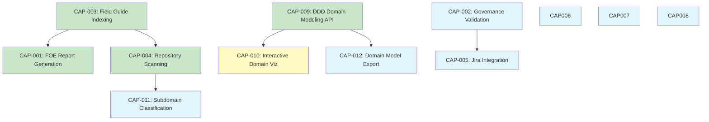

# Capability Mapping

This document maps system capabilities to the systems and subsystems that provide them, showing relationships and dependencies between capabilities and the taxonomy hierarchy.

## Capability Overview

Katalyst provides **12 capabilities** across three categories:

- **Business Capabilities** (10): Core functional areas
- **Technical Capabilities** (1): Infrastructure enablers
- **Hybrid Capabilities** (1): Business + Technical

## Capabilities × Systems Matrix

| Capability | ID | Primary System | Supporting Systems | Relationship Type | Status |
|------------|----|-----------------|--------------------|-------------------|---------|
| **FOE Report Generation** | CAP-001 | `scanner.intelligence.katalyst` | `field-guide-tools.intelligence.katalyst`, `web-ui.intelligence.katalyst` | implements, supports | ✅ Stable |
| **Governance Validation** | CAP-002 | `governance.delivery-framework.katalyst` | `api-gateway.platform.katalyst` | implements, supports | 📋 Planned |
| **Field Guide Indexing** | CAP-003 | `field-guide-tools.intelligence.katalyst` | `scanner.intelligence.katalyst` | implements, enables | ✅ Stable |
| **Repository Scanning** | CAP-004 | `scanner.intelligence.katalyst` | `ai-agents.intelligence.katalyst` | implements, depends-on | ✅ Stable |
| **Jira Integration** | CAP-005 | `api-gateway.platform.katalyst` | `governance.delivery-framework.katalyst` | implements, supports | 📋 Planned |
| **Confluence Integration** | CAP-006 | `api-gateway.platform.katalyst` | `documentation.delivery-framework.katalyst` | implements, supports | 📋 Planned |
| **GitHub Integration** | CAP-007 | `api-gateway.platform.katalyst` | `scanner.intelligence.katalyst` | implements, supports | 📋 Planned |
| **Real-time Streaming** | CAP-008 | `api-gateway.platform.katalyst` | - | implements | 📋 Planned |
| **DDD Domain Modeling API** | CAP-009 | `api-gateway.platform.katalyst` | `governance.delivery-framework.katalyst` | implements, supports | ✅ Stable |
| **Interactive Domain Visualization** | CAP-010 | `web-ui.intelligence.katalyst` | `api-gateway.platform.katalyst` | implements, depends-on | 🚧 In Progress |
| **Subdomain Classification** | CAP-011 | `scanner.intelligence.katalyst` | `ai-agents.intelligence.katalyst` | implements, depends-on | 📋 Planned |
| **Domain Model Export Pipeline** | CAP-012 | `api-gateway.platform.katalyst` | `documentation.delivery-framework.katalyst` | implements, supports | 📋 Planned |

**Legend**:
- ✅ **Stable**: Implemented and production-ready
- 🚧 **In Progress**: Currently being developed
- 📋 **Planned**: Not yet started

---

## Relationship Types

### 1. Implements
**Definition**: System provides the capability directly  
**Example**: `scanner.intelligence.katalyst` **implements** CAP-004 (Repository Scanning)  
**FQTN Notation**: `CAP-004 --[implements]--> scanner.intelligence.katalyst`

### 2. Supports
**Definition**: System enables or enhances the capability  
**Example**: `field-guide-tools.intelligence.katalyst` **supports** CAP-001 (FOE Report Generation)  
**FQTN Notation**: `CAP-001 --[supports]--> field-guide-tools.intelligence.katalyst`

### 3. Depends-On
**Definition**: Capability requires another system to function  
**Example**: CAP-010 (Interactive Domain Visualization) **depends-on** `api-gateway.platform.katalyst`  
**FQTN Notation**: `CAP-010 --[depends-on]--> api-gateway.platform.katalyst`

### 4. Enables
**Definition**: System provides foundational functionality for other capabilities  
**Example**: `field-guide-tools.intelligence.katalyst` **enables** CAP-004 (Repository Scanning)  
**FQTN Notation**: `field-guide-tools.intelligence.katalyst --[enables]--> CAP-004`

---

## Capability Details

### CAP-001: FOE Report Generation
**Category**: Business  
**Status**: ✅ Stable  

**Primary System**: `scanner.intelligence.katalyst`  
**FQTN**: `scanner.intelligence.katalyst`

**Supporting Systems**:
- `field-guide-tools.intelligence.katalyst` (provides indices)
- `web-ui.intelligence.katalyst` (visualizes reports)

**Relationships**:
```
CAP-001 --[implements]--> scanner.intelligence.katalyst
CAP-001 --[supports]--> field-guide-tools.intelligence.katalyst
CAP-001 --[supports]--> web-ui.intelligence.katalyst
```

**Dependencies**:
- `ai-agents.intelligence.katalyst` (for scanner agents)
- `field-guide-tools.intelligence.katalyst` (for method/observation indices)

**Personas Using**:
- PER-001: Engineering Team Lead
- PER-002: Platform Engineer

**User Stories**:
- US-001: View FOE Scan Report

---

### CAP-002: Governance Validation
**Category**: Business  
**Status**: 📋 Planned  

**Primary System**: `governance.delivery-framework.katalyst`  
**FQTN**: `governance.delivery-framework.katalyst`

**Supporting Systems**:
- `api-gateway.platform.katalyst` (API integration)

**Relationships**:
```
CAP-002 --[implements]--> governance.delivery-framework.katalyst
CAP-002 --[supports]--> api-gateway.platform.katalyst
```

**Dependencies**:
- `@foe/schemas` package (Zod schemas)
- Markdown parsers for frontmatter validation

**Personas Using**:
- PER-002: Platform Engineer
- PER-003: AI Agent
- PER-004: Documentation Author

**User Stories**:
- US-002: Track Governance Health
- US-003: Governance Zod Schemas
- US-008: Validate Before Commit
- US-009: Advance Governance Gates

---

### CAP-003: Field Guide Indexing
**Category**: Business  
**Status**: ✅ Stable  

**Primary System**: `field-guide-tools.intelligence.katalyst`  
**FQTN**: `field-guide-tools.intelligence.katalyst`

**Supporting Systems**:
- `scanner.intelligence.katalyst` (consumes indices)

**Relationships**:
```
CAP-003 --[implements]--> field-guide-tools.intelligence.katalyst
CAP-003 --[enables]--> scanner.intelligence.katalyst
```

**Dependencies**:
- Markdown parsers (frontmatter extraction)
- JSON builders (indices generation)

**Personas Using**:
- PER-002: Platform Engineer
- PER-005: Framework Adopter

**User Stories**:
- US-004: Build Governance Index

---

### CAP-004: Repository Scanning
**Category**: Business  
**Status**: ✅ Stable  

**Primary System**: `scanner.intelligence.katalyst`  
**FQTN**: `scanner.intelligence.katalyst`

**Supporting Systems**:
- `ai-agents.intelligence.katalyst` (provides scanner agents)
- `field-guide-tools.intelligence.katalyst` (provides indices)

**Relationships**:
```
CAP-004 --[implements]--> scanner.intelligence.katalyst
CAP-004 --[depends-on]--> ai-agents.intelligence.katalyst
CAP-004 --[depends-on]--> field-guide-tools.intelligence.katalyst
```

**Dependencies**:
- Docker runtime
- OpenCode CLI
- Claude Sonnet 4.5 API

**Personas Using**:
- PER-001: Engineering Team Lead
- PER-002: Platform Engineer

**User Stories**:
- US-006: Scanner Docker Build

---

### CAP-005: Jira Integration
**Category**: Business  
**Status**: 📋 Planned  

**Primary System**: `api-gateway.platform.katalyst`  
**FQTN**: `api-gateway.platform.katalyst`

**Supporting Systems**:
- `governance.delivery-framework.katalyst` (maps ROAD items to Jira tickets)

**Relationships**:
```
CAP-005 --[implements]--> api-gateway.platform.katalyst
CAP-005 --[supports]--> governance.delivery-framework.katalyst
```

**Dependencies**:
- Jira REST API
- OAuth 2.0 authentication

**Personas Using**:
- PER-001: Engineering Team Lead
- PER-005: Framework Adopter

**User Stories**:
- To be defined

---

### CAP-006: Confluence Integration
**Category**: Business  
**Status**: 📋 Planned  

**Primary System**: `api-gateway.platform.katalyst`  
**FQTN**: `api-gateway.platform.katalyst`

**Supporting Systems**:
- `documentation.delivery-framework.katalyst` (exports docs to Confluence)

**Relationships**:
```
CAP-006 --[implements]--> api-gateway.platform.katalyst
CAP-006 --[supports]--> documentation.delivery-framework.katalyst
```

**Dependencies**:
- Confluence REST API
- OAuth 2.0 authentication
- Markdown to Confluence markup conversion

**Personas Using**:
- PER-004: Documentation Author
- PER-005: Framework Adopter

**User Stories**:
- To be defined

---

### CAP-007: GitHub Integration
**Category**: Business  
**Status**: 📋 Planned  

**Primary System**: `api-gateway.platform.katalyst`  
**FQTN**: `api-gateway.platform.katalyst`

**Supporting Systems**:
- `scanner.intelligence.katalyst` (scans GitHub repos)
- `governance.delivery-framework.katalyst` (syncs governance artifacts)

**Relationships**:
```
CAP-007 --[implements]--> api-gateway.platform.katalyst
CAP-007 --[supports]--> scanner.intelligence.katalyst
CAP-007 --[supports]--> governance.delivery-framework.katalyst
```

**Dependencies**:
- GitHub REST API
- GitHub App authentication

**Personas Using**:
- PER-002: Platform Engineer
- PER-005: Framework Adopter

**User Stories**:
- To be defined

---

### CAP-008: Real-time Streaming
**Category**: Technical  
**Status**: 📋 Planned  

**Primary System**: `api-gateway.platform.katalyst`  
**FQTN**: `api-gateway.platform.katalyst`

**Supporting Systems**: None (infrastructure capability)

**Relationships**:
```
CAP-008 --[implements]--> api-gateway.platform.katalyst
```

**Dependencies**:
- Server-Sent Events (SSE)
- WebSocket support (alternative)

**Personas Using**:
- PER-001: Engineering Team Lead (consumes streams)
- PER-002: Platform Engineer (implements streams)

**User Stories**:
- To be defined (scanner progress streaming)

---

### CAP-009: DDD Domain Modeling API
**Category**: Business  
**Status**: ✅ Stable  

**Primary System**: `api-gateway.platform.katalyst`  
**FQTN**: `api-gateway.platform.katalyst`

**Supporting Systems**:
- `governance.delivery-framework.katalyst` (provides DDD artifact schemas)

**Relationships**:
```
CAP-009 --[implements]--> api-gateway.platform.katalyst
CAP-009 --[supports]--> governance.delivery-framework.katalyst
```

**Dependencies**:
- `@foe/schemas/ddd` (Zod schemas for DDD artifacts)
- PostgreSQL (persistence)
- Drizzle ORM

**Personas Using**:
- PER-001: Engineering Team Lead
- PER-002: Platform Engineer
- PER-004: Documentation Author

**User Stories**:
- US-007: DDD Artifact Schemas
- US-012: Author DDD Model Docs
- US-028: Manage Domain Models via API
- US-029: View Domain Model in UI

**API Endpoints**:
- `POST /v1/domains` - Create domain
- `GET /v1/domains` - List domains
- `GET /v1/domains/:id` - Get domain details
- `PUT /v1/domains/:id` - Update domain
- `POST /v1/contexts` - Create bounded context
- `POST /v1/aggregates` - Create aggregate
- `POST /v1/value-objects` - Create value object
- `POST /v1/domain-events` - Create domain event

---

### CAP-010: Interactive Domain Visualization Engine
**Category**: Business  
**Status**: 🚧 In Progress  

**Primary System**: `web-ui.intelligence.katalyst`  
**FQTN**: `web-ui.intelligence.katalyst`

**Supporting Systems**:
- `api-gateway.platform.katalyst` (provides domain data via API)

**Relationships**:
```
CAP-010 --[implements]--> web-ui.intelligence.katalyst
CAP-010 --[depends-on]--> api-gateway.platform.katalyst
```

**Dependencies**:
- React 18
- `@xyflow/react` (React Flow)
- DDD API (CAP-009)

**Personas Using**:
- PER-001: Engineering Team Lead
- PER-004: Documentation Author

**User Stories**:
- US-029: View Domain Model in UI

**Features**:
- Context map visualization
- Aggregate tree view
- Event flow diagrams
- Workflow visualization
- Glossary browser

---

### CAP-011: Subdomain Classification
**Category**: Business  
**Status**: 📋 Planned  

**Primary System**: `scanner.intelligence.katalyst`  
**FQTN**: `scanner.intelligence.katalyst`

**Supporting Systems**:
- `ai-agents.intelligence.katalyst` (AI analysis)

**Relationships**:
```
CAP-011 --[implements]--> scanner.intelligence.katalyst
CAP-011 --[depends-on]--> ai-agents.intelligence.katalyst
```

**Dependencies**:
- Claude Sonnet 4.5 API
- DDD subdomain classification rules

**Personas Using**:
- PER-001: Engineering Team Lead
- PER-002: Platform Engineer

**User Stories**:
- To be defined

---

### CAP-012: Domain Model Export Pipeline
**Category**: Business  
**Status**: 📋 Planned  

**Primary System**: `api-gateway.platform.katalyst`  
**FQTN**: `api-gateway.platform.katalyst`

**Supporting Systems**:
- `documentation.delivery-framework.katalyst` (exports to Docusaurus)

**Relationships**:
```
CAP-012 --[implements]--> api-gateway.platform.katalyst
CAP-012 --[supports]--> documentation.delivery-framework.katalyst
```

**Dependencies**:
- DDD API (CAP-009)
- Markdown generation
- Mermaid diagram generation

**Personas Using**:
- PER-004: Documentation Author
- PER-005: Framework Adopter

**User Stories**:
- To be defined

---

## Capability Dependency Graph



**Legend**:
- 🟢 Green: Stable
- 🟡 Yellow: In Progress
- 🔵 Blue: Planned

---

## Cross-Subsystem Capabilities

Some capabilities span multiple subsystems:

### FOE Report Generation (CAP-001)
- **Intelligence Subsystem**: Scanner agents, orchestration
- **Delivery Subsystem**: Field guide indices
- **Visualization**: Web UI report viewer

### Governance Validation (CAP-002)
- **Delivery Subsystem**: Schemas, parsers, validators
- **Platform Subsystem**: API integration
- **Intelligence Subsystem**: AI agent validation

### Domain Modeling (CAP-009 + CAP-010)
- **Platform Subsystem**: API for CRUD operations
- **Delivery Subsystem**: Governance schemas
- **Intelligence Subsystem**: Interactive visualization

---

## Adding New Capabilities

### Checklist

When adding a new capability:

- [ ] Define capability ID (CAP-XXX)
- [ ] Assign category (Business, Technical, Hybrid)
- [ ] Identify primary implementing system (FQTN)
- [ ] Identify supporting systems (FQTNs)
- [ ] Define relationships (implements, supports, depends-on, enables)
- [ ] List dependencies (APIs, libraries, external services)
- [ ] Map to personas (PER-XXX)
- [ ] Map to user stories (US-XXX)
- [ ] Update capability mapping matrix
- [ ] Update dependency graph
- [ ] Create capability document (CAP-XXX.md)
- [ ] Update this mapping documentation

---

**Last Updated**: 2026-02-16  
**Maintained By**: Product & Engineering Teams  
**Version**: 1.0.0
