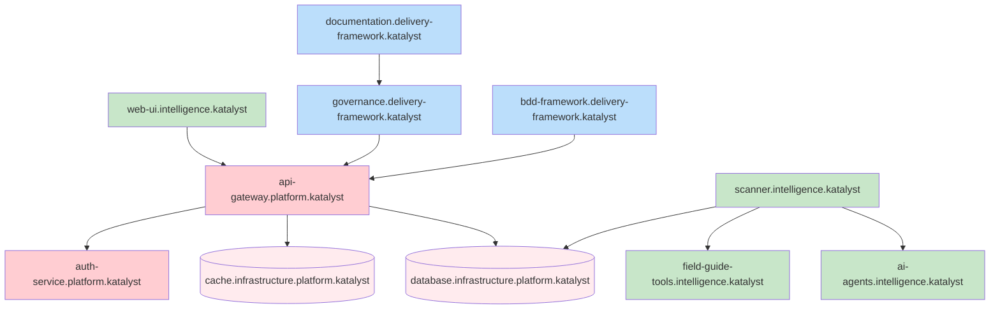
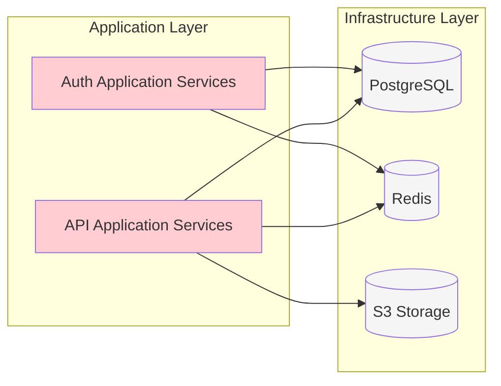
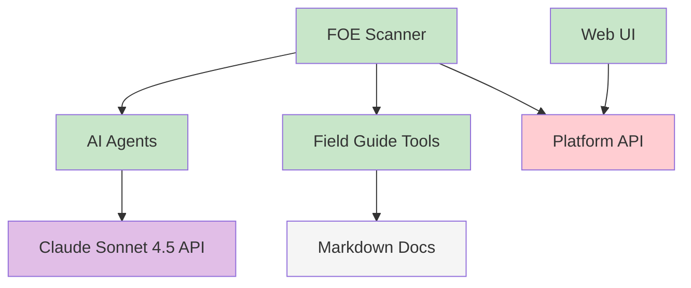
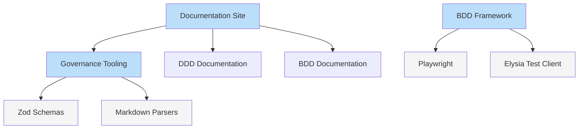
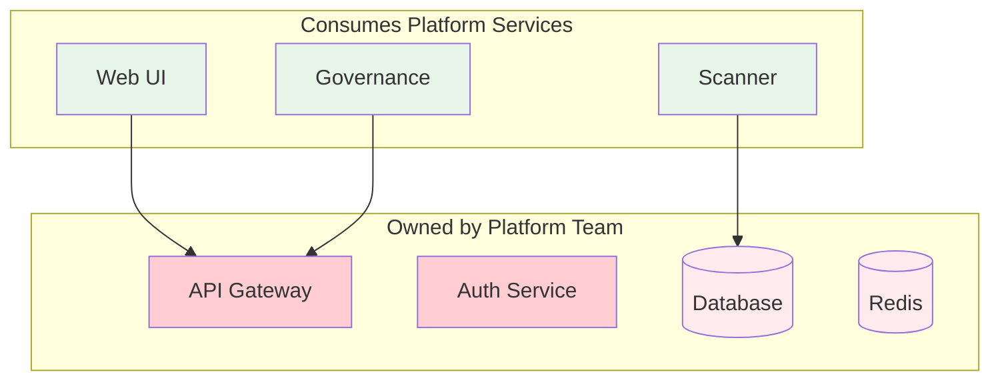
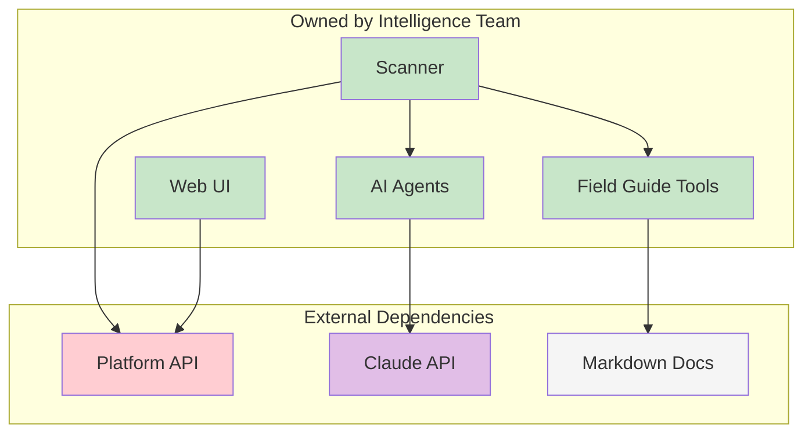
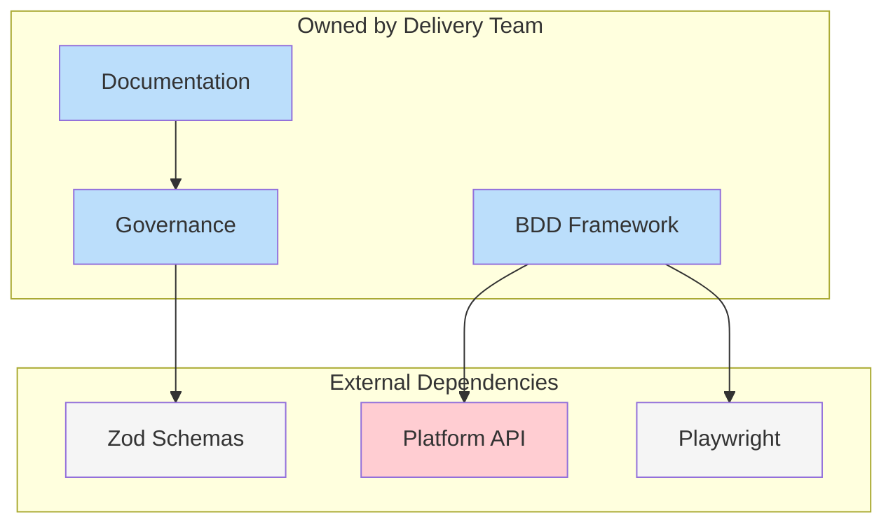
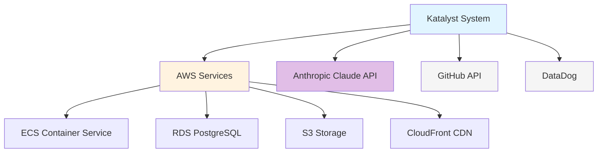

# System Dependency Graph

This document visualizes the dependencies and relationships between systems in the Katalyst ecosystem.

## Complete System Dependencies



**Legend**:
- 🔴 Red: Platform subsystem
- 🟢 Green: Intelligence subsystem
- 🔵 Blue: Delivery subsystem

---

## Dependencies by Layer

### View 1: Platform Layer Dependencies



---

### View 2: Intelligence Layer Dependencies



---

### View 3: Delivery Layer Dependencies



---

## Dependencies by Team

### Platform Team Ownership



**Platform Team** provides:
- REST API gateway (`api-gateway.platform.katalyst`)
- Authentication services (`auth-service.platform.katalyst`)
- Database infrastructure (`database.infrastructure.platform.katalyst`)
- Caching infrastructure (`cache.infrastructure.platform.katalyst`)

**Consumers**:
- Intelligence Team (via API, database)
- Delivery Team (via API)
- External clients (via API)

---

### Intelligence Team Ownership



**Intelligence Team** provides:
- FOE scanner (`scanner.intelligence.katalyst`)
- AI agent orchestration (`ai-agents.intelligence.katalyst`)
- Field Guide indexing (`field-guide-tools.intelligence.katalyst`)
- Report visualization (`web-ui.intelligence.katalyst`)

**Dependencies**:
- Platform Team (API, database)
- External AI services (Claude Sonnet 4.5)
- Markdown documentation sources

---

### Delivery Team Ownership



**Delivery Team** provides:
- Governance validation (`governance.delivery-framework.katalyst`)
- BDD testing framework (`bdd-framework.delivery-framework.katalyst`)
- Documentation platform (`documentation.delivery-framework.katalyst`)

**Dependencies**:
- Platform Team (API for governance data)
- Open-source libraries (Zod, Playwright, Docusaurus)

---

## Critical Path Analysis

### Critical Path for FOE Report Generation

```mermaid
graph LR
    A[User Triggers Scan] --> B[Scanner Container Starts]
    B --> C[Load Field Guide Indices]
    C --> D[Dispatch AI Agents]
    D --> E[Analyze Repository]
    E --> F[Generate FOE Report]
    F --> G[Store in Database]
    G --> H[Display in Web UI]
    
    style A fill:#e3f2fd
    style B fill:#fff3e0
    style C fill:#fff3e0
    style D fill:#fff3e0
    style E fill:#fff3e0
    style F fill:#fff3e0
    style G fill:#e8f5e9
    style H fill:#e8f5e9
```



**Critical Systems**:
1. `scanner.intelligence.katalyst` (orchestrator)
2. `field-guide-tools.intelligence.katalyst` (data dependency)
3. `ai-agents.intelligence.katalyst` (execution dependency)
4. `database.infrastructure.platform.katalyst` (persistence)
5. `web-ui.intelligence.katalyst` (presentation)

**Failure Points**:
- If Field Guide indices missing → Scanner fails
- If AI API unavailable → Scanner degrades (partial results)
- If database down → Results not persisted
- If Web UI down → Results not visible (but stored)

**Mitigation**:
- Pre-build Field Guide indices in Docker image
- Retry logic for AI API calls
- Database high availability (read replicas)
- Web UI served from CDN (99.9% uptime)

---

### Critical Path for Domain Model CRUD

```mermaid
graph LR
    A[User Request] --> B[API Gateway]
    B --> C[Auth Service]
    C --> D[Application Service]
    D --> E[Domain Layer]
    E --> F[Infrastructure Layer]
    F --> G[PostgreSQL Database]
    G --> H[Return to User]
    
    style A fill:#e3f2fd
    style B fill:#ffcdd2
    style C fill:#ffcdd2
    style D fill:#ffcdd2
    style E fill:#fff3e0
    style F fill:#fff3e0
    style G fill:#f5f5f5
    style H fill:#e8f5e9
```



**Critical Systems**:
1. `api-gateway.platform.katalyst` (entry point)
2. `auth-service.platform.katalyst` (security gate)
3. `database.infrastructure.platform.katalyst` (persistence)

**Failure Points**:
- If API gateway down → All requests fail (single point of failure)
- If auth service down → All requests rejected
- If database primary down → Write operations fail (reads continue via replicas)

**Mitigation**:
- API gateway multi-instance (4 instances in prod, load balanced)
- Auth service multi-instance (4 instances in prod)
- Database high availability (primary + 2 replicas, auto-failover)

---

## Circular Dependency Detection

**Status**: ✅ No circular dependencies detected

### Validation Rules

1. **Layer Dependencies**: Must flow inward only (UI → App → Domain)
2. **Subsystem Dependencies**: Can reference other subsystems but no cycles
3. **Service Dependencies**: No service should depend on itself (directly or transitively)

### Automated Checks

```bash
# Check for circular dependencies in codebase
bun run check-circular-deps

# Output:
✓ No circular dependencies found in platform subsystem
✓ No circular dependencies found in intelligence subsystem
✓ No circular dependencies found in delivery subsystem
```

---

## Dependency Impact Analysis

### Scenario 1: Database Outage

**Affected Systems**:
- `api-gateway.platform.katalyst` (cannot persist data)
- `scanner.intelligence.katalyst` (cannot store scan results)
- `auth-service.platform.katalyst` (cannot validate sessions)

**Workarounds**:
- Read-only mode (use read replicas)
- Cache-first strategy (serve stale data)
- Queue write operations for later processing

**Recovery Time**:
- Automatic failover to replica: < 1 minute
- Manual restoration from backup: 1 hour (RTO)

---

### Scenario 2: Claude API Rate Limit

**Affected Systems**:
- `scanner.intelligence.katalyst` (AI agents cannot run)
- `ai-agents.intelligence.katalyst` (degraded functionality)

**Workarounds**:
- Queue scan requests
- Prioritize critical scans
- Use cached results if available

**Recovery Time**:
- Rate limits typically reset: 1 hour
- Fallback to rule-based analysis (no AI)

---

### Scenario 3: API Gateway Down

**Affected Systems**:
- `web-ui.intelligence.katalyst` (cannot fetch data)
- `governance.delivery-framework.katalyst` (cannot sync artifacts)
- `bdd-framework.delivery-framework.katalyst` (API tests fail)

**Workarounds**:
- Serve cached static reports from CDN
- Direct database access for internal tools (emergency only)

**Recovery Time**:
- Auto-scaling adds instances: < 5 minutes
- Manual intervention: < 15 minutes

---

## External Dependencies

### Third-Party Services



**Critical External Dependencies**:

| Service | Purpose | SLA | Fallback |
|---------|---------|-----|----------|
| **AWS ECS** | Container orchestration | 99.99% | N/A (infrastructure) |
| **AWS RDS** | Database hosting | 99.95% | Multi-AZ failover |
| **Claude API** | AI analysis | 99.9% | Rule-based analysis |
| **GitHub API** | Code repository access | 99.9% | Local git clones |
| **DataDog** | Monitoring | 99.9% | Fallback to CloudWatch |

---

## Dependency Management

### Adding New Dependencies

**Checklist**:
- [ ] Document dependency purpose
- [ ] Evaluate SLA and reliability
- [ ] Plan fallback strategy
- [ ] Update dependency graph
- [ ] Add to monitoring
- [ ] Create runbook for failures
- [ ] Get security approval (if external)
- [ ] Add to risk register

**Example: Adding Jira Integration**

1. **Document**: "Jira API for syncing ROAD items to Jira tickets"
2. **SLA**: 99.9% (Atlassian Cloud)
3. **Fallback**: Manual ticket creation
4. **Graph**: `api-gateway.platform.katalyst --> Jira API`
5. **Monitoring**: Track Jira API response times
6. **Runbook**: [Jira Integration Failure Runbook](link)
7. **Security**: OAuth 2.0 approved by security team
8. **Risk**: Added to external dependency risk register

---

### Removing Dependencies

**Checklist**:
- [ ] Identify all consumers of the dependency
- [ ] Plan migration strategy
- [ ] Update documentation
- [ ] Remove from dependency graph
- [ ] Remove from monitoring
- [ ] Archive runbooks
- [ ] Notify affected teams

---

## Visualization Tools

### Generating Dependency Graphs

```bash
# Generate dependency graph from codebase
bun run generate-dependency-graph

# Output formats
--format=mermaid  # Mermaid diagram (for Docusaurus)
--format=dot      # Graphviz DOT format
--format=json     # Machine-readable JSON

# Example: Generate Mermaid diagram
bun run generate-dependency-graph --format=mermaid > dependency-graph.mmd
```

### Interactive Dependency Explorer

**Coming Soon**: Interactive web-based dependency explorer

**Features**:
- Click nodes to see details
- Filter by subsystem, team, or layer
- Highlight critical paths
- Show impact analysis for changes
- Export diagrams

---

## Contributing

To update dependency information:

1. **Identify change**: New dependency, removed dependency, or modified relationship
2. **Update diagrams**: Modify Mermaid diagrams in this file
3. **Update impact analysis**: If critical path affected
4. **Test locally**: Verify Mermaid renders correctly
5. **Open PR** with changes
6. **Get approval** from affected teams
7. **Merge** and announce in #engineering-all

---

**Last Updated**: 2026-02-16  
**Maintained By**: Platform Team + Architecture Review Board  
**Version**: 1.0.0
