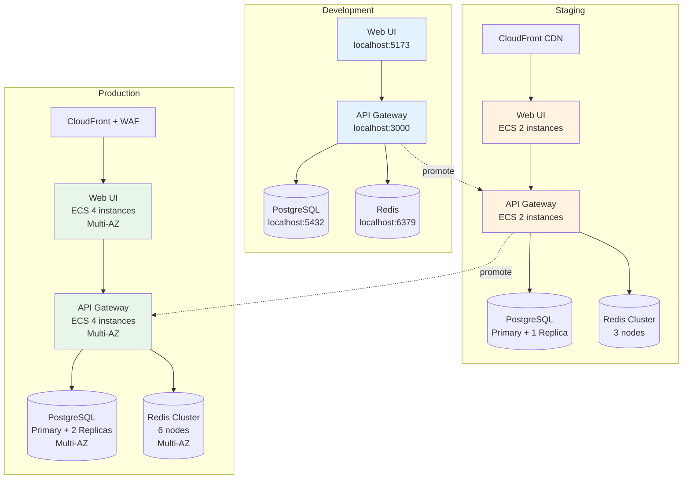

# Environment Structure

This document defines the environment configurations, deployment topology, and promotion workflows for the Katalyst ecosystem.

## Environment Overview

Katalyst supports **three primary environments** with distinct purposes:

| Environment | Purpose | Audience | Data | Availability |
|-------------|---------|----------|------|--------------|
| **Development (dev)** | Active development and testing | Engineers | Synthetic/Test | Best effort |
| **Staging (staging)** | Pre-production validation | QA, Product, Stakeholders | Production-like | High |
| **Production (prod)** | Live customer-facing system | End users | Real/Production | Critical (99.9% SLA) |

---

## Environment Definitions

### Development Environment (dev)

**Purpose**: Rapid iteration and testing

**Characteristics**:
- Frequent deployments (multiple times per day)
- Latest code changes
- Synthetic/test data only
- Relaxed security constraints
- Verbose logging and debugging enabled
- No SLA guarantees

**Infrastructure**:
- **Hosting**: Local Docker Compose or AWS ECS (dev cluster)
- **Database**: PostgreSQL (single instance, no replication)
- **Cache**: Redis (single instance)
- **Storage**: Local filesystem or S3 (dev bucket)

**Access**:
- **Engineers**: Full access (read/write)
- **QA**: Read-only access
- **Stakeholders**: No access

**Data**:
- Synthetic test data
- Regularly reset/wiped
- No PII or sensitive data

**URLs**:
- API: `https://api-dev.katalyst.dev`
- Web UI: `https://dev.katalyst.dev`
- Docs: `http://localhost:3000` (local)

---

### Staging Environment (staging)

**Purpose**: Pre-production validation and demos

**Characteristics**:
- Daily or weekly deployments
- Production candidate code
- Production-like data (sanitized)
- Production-equivalent security
- Standard logging
- High availability target (99% uptime)

**Infrastructure**:
- **Hosting**: AWS ECS (staging cluster)
- **Database**: PostgreSQL (primary + read replica)
- **Cache**: Redis (cluster mode)
- **Storage**: S3 (staging bucket)
- **CDN**: CloudFront
- **Monitoring**: DataDog

**Access**:
- **Engineers**: Full access (read/write)
- **QA**: Full access (read/write)
- **Product Managers**: Read-only access
- **Stakeholders**: Demo access (read-only)

**Data**:
- Production-like data (anonymized/sanitized)
- Refreshed weekly from production backups
- Safe for demos and testing

**URLs**:
- API: `https://api-staging.katalyst.dev`
- Web UI: `https://staging.katalyst.dev`
- Docs: `https://docs-staging.katalyst.dev`

**Deployment**:
- **Trigger**: Manual approval after passing CI
- **Frequency**: Daily (or on-demand)
- **Rollback**: Automated rollback on health check failure

---

### Production Environment (prod)

**Purpose**: Live customer-facing system

**Characteristics**:
- Scheduled deployments (weekly or bi-weekly)
- Thoroughly tested code only
- Real production data
- Maximum security constraints
- Structured logging (no debug logs)
- Critical availability (99.9% SLA)

**Infrastructure**:
- **Hosting**: AWS ECS (production cluster, multi-AZ)
- **Database**: PostgreSQL (primary + 2 read replicas, automated backups)
- **Cache**: Redis (cluster mode, multi-AZ)
- **Storage**: S3 (production bucket, versioning enabled)
- **CDN**: CloudFront (with WAF)
- **Monitoring**: DataDog + PagerDuty

**Access**:
- **On-Call Engineers**: Emergency access only (logged and audited)
- **Platform Team Lead**: Read-only access
- **Customers**: Full application access

**Data**:
- Real production data
- PII and sensitive information
- Encrypted at rest and in transit
- Automated backups (daily, retained 30 days)

**URLs**:
- API: `https://api.katalyst.dev`
- Web UI: `https://katalyst.dev`
- Docs: `https://docs.katalyst.dev`

**Deployment**:
- **Trigger**: Manual approval after staging validation
- **Frequency**: Weekly (Tuesdays, 10:00 AM PST)
- **Rollback**: Automated rollback on error rate spike
- **Health Checks**: Pre-deployment and post-deployment validation

**SLA**:
- **Availability**: 99.9% uptime (43.2 minutes downtime/month max)
- **Response Time**: p95 < 500ms
- **Error Rate**: < 0.1%

---

## Per-System Environment Configurations

### Platform Subsystem

#### `api-gateway.platform.katalyst`

| Configuration | dev | staging | prod |
|---------------|-----|---------|------|
| **Instances** | 1 | 2 | 4 (multi-AZ) |
| **CPU** | 0.5 vCPU | 1 vCPU | 2 vCPU |
| **Memory** | 512 MB | 1 GB | 2 GB |
| **Rate Limiting** | Disabled | 1000 req/min | 100 req/min/user |
| **Logging** | DEBUG | INFO | WARN + ERROR |
| **CORS** | `*` | `*.katalyst.dev` | `katalyst.dev` only |
| **Auth** | Optional | Required | Required + 2FA |

**Environment Variables**:
```bash
# dev
DATABASE_URL=postgresql://localhost:5432/katalyst_dev
REDIS_URL=redis://localhost:6379
LOG_LEVEL=debug
CORS_ORIGIN=*

# staging
DATABASE_URL=postgresql://staging-db.internal:5432/katalyst_staging
REDIS_URL=redis://staging-cache.internal:6379
LOG_LEVEL=info
CORS_ORIGIN=*.katalyst.dev

# prod
DATABASE_URL=postgresql://prod-db.internal:5432/katalyst_prod
REDIS_URL=redis://prod-cache.internal:6379
LOG_LEVEL=warn
CORS_ORIGIN=katalyst.dev
```

---

#### `auth-service.platform.katalyst`

| Configuration | dev | staging | prod |
|---------------|-----|---------|------|
| **Instances** | 1 | 2 | 4 (multi-AZ) |
| **Session TTL** | 24 hours | 8 hours | 4 hours |
| **JWT Expiry** | 7 days | 2 days | 1 day |
| **Password Policy** | Relaxed | Standard | Strict |
| **2FA** | Disabled | Optional | Required (admin) |
| **Audit Logging** | Basic | Standard | Comprehensive |

---

#### `database.infrastructure.platform.katalyst`

| Configuration | dev | staging | prod |
|---------------|-----|---------|------|
| **Instance Type** | db.t3.micro | db.t3.medium | db.r5.xlarge |
| **Storage** | 20 GB | 100 GB | 500 GB |
| **Backups** | None | Daily (7 day retention) | Daily (30 day retention) |
| **Read Replicas** | 0 | 1 | 2 (multi-AZ) |
| **Encryption** | Disabled | Enabled | Enabled (KMS) |
| **Connection Pool** | 10 | 50 | 100 |

---

### Intelligence Subsystem

#### `scanner.intelligence.katalyst`

| Configuration | dev | staging | prod |
|---------------|-----|---------|------|
| **Container Memory** | 2 GB | 4 GB | 8 GB |
| **Timeout** | 10 min | 20 min | 30 min |
| **Concurrent Scans** | 1 | 2 | 4 |
| **AI API Key** | Dev key | Staging key | Prod key |
| **Result Storage** | Local filesystem | S3 (staging bucket) | S3 (prod bucket) |

---

#### `web-ui.intelligence.katalyst`

| Configuration | dev | staging | prod |
|---------------|-----|---------|------|
| **Build** | Development | Production | Production (optimized) |
| **Source Maps** | Enabled | Enabled | Disabled |
| **CDN** | None | CloudFront | CloudFront + WAF |
| **Caching** | Disabled | 1 hour | 24 hours |
| **Bundle Size** | Unoptimized | Optimized | Minified + Tree-shaken |

---

### Delivery Subsystem

#### `documentation.delivery-framework.katalyst`

| Configuration | dev | staging | prod |
|---------------|-----|---------|------|
| **Hosting** | Local (`bun run start`) | GitHub Pages | GitHub Pages + CloudFlare |
| **Build Frequency** | On-demand | On PR merge | On release tag |
| **Search Indexing** | Disabled | Enabled | Enabled (Algolia) |
| **Analytics** | Disabled | Enabled (dev tracking) | Enabled (Google Analytics) |

---

## Deployment Topology



---

## Environment Promotion Workflow

### Stage 1: Development → Staging

**Pre-Promotion Checklist**:
- [ ] All unit tests pass (`bun test`)
- [ ] All BDD tests pass (`just bdd-test`)
- [ ] CI pipeline green
- [ ] Code review approved
- [ ] No critical security vulnerabilities

**Promotion Process**:
1. Merge PR to `main` branch
2. CI automatically builds Docker images
3. Tag image with `staging-{git-sha}`
4. Deploy to staging ECS cluster
5. Run smoke tests
6. Notify QA team in Slack

**Rollback**:
- Automatic rollback if health checks fail
- Manual rollback via GitHub Actions workflow

**Frequency**: Daily (or on-demand)

---

### Stage 2: Staging → Production

**Pre-Promotion Checklist**:
- [ ] All staging tests pass (7 days stable)
- [ ] QA sign-off
- [ ] Product Manager approval
- [ ] No known critical bugs
- [ ] Release notes prepared
- [ ] Rollback plan documented
- [ ] On-call engineer available

**Promotion Process**:
1. Create release tag (`v1.2.3`)
2. Trigger production deployment workflow
3. Blue/green deployment to production ECS
4. Run comprehensive health checks
5. Gradual traffic shift (10% → 50% → 100%)
6. Monitor error rates and latency
7. Full cutover after 30 minutes of stability
8. Notify #deployments channel

**Rollback**:
- Automatic rollback on error rate spike (> 1%)
- Manual rollback via production runbook

**Frequency**: Weekly (Tuesdays, 10:00 AM PST)

---

## Configuration Management

### Secrets Management

**Development**:
- Stored in `.env.local` (gitignored)
- Hardcoded test credentials acceptable

**Staging & Production**:
- **AWS Secrets Manager** for sensitive credentials
- **Environment variables** for non-sensitive config
- **KMS encryption** for secrets at rest
- **IAM roles** for service-to-service auth

**Secret Rotation**:
- Database passwords: Quarterly
- API keys: Annually
- JWT signing keys: Never (versioned keys)

---

### Feature Flags

Use feature flags for gradual rollouts:

```typescript
// Example: New feature flag
if (featureFlags.isEnabled('jira-integration', environment)) {
  // New Jira integration code
} else {
  // Fallback to old behavior
}
```

**Flag Management**:
- **dev**: All flags enabled by default
- **staging**: Flags configurable via admin UI
- **prod**: Flags require approval to enable

---

## Monitoring & Alerting

### Development
- **Logging**: Console output (DEBUG level)
- **Monitoring**: None
- **Alerting**: None

### Staging
- **Logging**: DataDog (INFO level)
- **Monitoring**: Basic metrics (CPU, memory, request count)
- **Alerting**: Slack notifications on service crash

### Production
- **Logging**: DataDog (WARN + ERROR level)
- **Monitoring**: Comprehensive (latency, error rate, throughput, saturation)
- **Alerting**: PagerDuty for critical issues
  - Error rate > 1%
  - p95 latency > 1000ms
  - Service unavailable > 1 minute
  - Database connection pool exhausted

---

## Disaster Recovery

### Backup Strategy

**Database**:
- **dev**: No backups
- **staging**: Daily snapshots (7-day retention)
- **prod**: Daily snapshots (30-day retention) + continuous WAL archiving

**Recovery Point Objective (RPO)**:
- **dev**: N/A
- **staging**: 24 hours
- **prod**: 1 hour

**Recovery Time Objective (RTO)**:
- **dev**: N/A
- **staging**: 4 hours
- **prod**: 1 hour

### Disaster Recovery Scenarios

**Scenario 1: Database Corruption**
1. Identify last known good backup
2. Restore from snapshot
3. Replay WAL logs to minimize data loss
4. Verify data integrity
5. Resume service

**Scenario 2: Region Outage**
1. Activate disaster recovery (DR) region
2. Update DNS to point to DR endpoint
3. Verify service functionality
4. Monitor until primary region restored

**Scenario 3: Data Breach**
1. Immediately revoke compromised credentials
2. Isolate affected systems
3. Notify security team and stakeholders
4. Conduct forensic analysis
5. Restore from pre-breach backup if needed

---

## Contributing

To update environment configurations:

1. **Open PR** with proposed changes
2. **Document rationale** (why this change is needed)
3. **Test in dev environment** first
4. **Get approval** from Platform Team Lead
5. **Deploy to staging** and validate
6. **Schedule production deployment**
7. **Update this documentation**

---

**Last Updated**: 2026-02-16  
**Maintained By**: Platform Team + DevOps  
**Version**: 1.0.0
