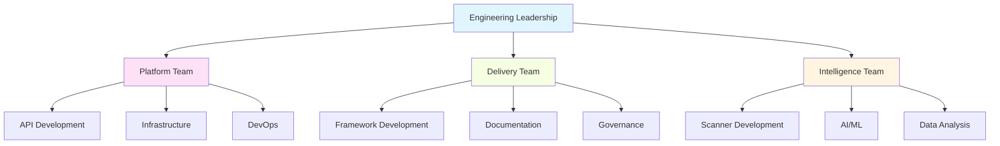

# Organizational Structure

This document defines the organizational hierarchy, team structures, and ownership mapping for the Katalyst Delivery Framework.

## Team Hierarchy

## Teams & Responsibilities

### Platform Team
**Mission**: Build and maintain the core platform infrastructure and APIs

**Responsibilities**:
- API gateway development and maintenance
- Database schema design and migrations
- Infrastructure provisioning and scaling
- Security and authentication services
- Performance optimization

**Systems Owned**:
- `api-gateway.platform.katalyst`
- `auth-service.platform.katalyst`
- `database.infrastructure.platform.katalyst`

**Key Personnel**:
- **Team Lead**: TBD
- **Senior Engineers**: TBD
- **DevOps Lead**: TBD

**Contact**:
- **Slack**: #platform-team
- **Email**: platform@katalyst.dev
- **On-Call Rotation**: PagerDuty - Platform Team

---

### Delivery Team
**Mission**: Create governance frameworks and delivery tooling

**Responsibilities**:
- Governance schema design
- Delivery framework documentation
- BDD test framework
- CI/CD pipeline configuration
- Roadmap management

**Systems Owned**:
- `delivery-framework.katalyst`
- `governance.delivery-framework.katalyst`
- `bdd-framework.delivery-framework.katalyst`

**Key Personnel**:
- **Team Lead**: TBD
- **Technical Writers**: TBD
- **Governance Specialists**: TBD

**Contact**:
- **Slack**: #delivery-team
- **Email**: delivery@katalyst.dev

---

### Intelligence Team
**Mission**: Develop AI-powered scanning and analysis tools

**Responsibilities**:
- FOE scanner development
- AI agent orchestration
- Domain analysis algorithms
- Field guide indexing
- Report generation

**Systems Owned**:
- `scanner.intelligence.katalyst`
- `ai-agents.intelligence.katalyst`
- `field-guide-tools.intelligence.katalyst`
- `web-ui.intelligence.katalyst`

**Key Personnel**:
- **Team Lead**: TBD
- **AI/ML Engineers**: TBD
- **Frontend Engineers**: TBD

**Contact**:
- **Slack**: #intelligence-team
- **Email**: intelligence@katalyst.dev

---

## System Ownership Mapping

### RACI Matrix

**RACI**: Responsible, Accountable, Consulted, Informed

| System / Capability | Platform Team | Delivery Team | Intelligence Team | Engineering Lead |
|---------------------|---------------|---------------|-------------------|------------------|
| **API Gateway** | R, A | I | I | C |
| **Authentication Service** | R, A | C | I | C |
| **Database Infrastructure** | R, A | C | I | C |
| **Governance Schemas** | C | R, A | I | C |
| **Delivery Framework Docs** | I | R, A | I | C |
| **BDD Test Framework** | C | R, A | C | C |
| **FOE Scanner** | C | I | R, A | C |
| **AI Agent Orchestration** | C | I | R, A | C |
| **Field Guide Indexing** | I | C | R, A | C |
| **Web UI Visualization** | C | I | R, A | C |
| **CI/CD Pipelines** | R, A | C | C | C |
| **Monitoring & Alerting** | R, A | I | I | C |

**Legend**:
- **R (Responsible)**: Does the work
- **A (Accountable)**: Ultimately answerable for completion
- **C (Consulted)**: Provides input
- **I (Informed)**: Kept up-to-date

---

## Cross-Team Dependencies

### Platform → Delivery
- **API Schemas**: Platform provides API definitions; Delivery documents them
- **Database Migrations**: Platform implements; Delivery validates governance compliance
- **CI/CD**: Platform maintains infrastructure; Delivery defines workflow

### Platform → Intelligence
- **API Gateway**: Intelligence consumes Platform APIs for scanner integration
- **Authentication**: Intelligence uses Platform auth services for bot accounts
- **Database**: Intelligence stores scan results via Platform data services

### Delivery → Intelligence
- **Governance Validation**: Intelligence scanner validates against Delivery governance schemas
- **BDD Tests**: Intelligence uses Delivery's BDD framework for testing
- **Documentation**: Intelligence references Delivery framework docs

---

## Decision-Making Authority

### Architecture Decisions (ADRs)
- **Proposal**: Any team member
- **Review**: Team Leads + Engineering Leadership
- **Approval**: Engineering Leadership
- **Documentation**: Proposing team

### Technical Stack Changes
- **Proposal**: Team Lead
- **Review**: All affected teams
- **Approval**: Engineering Leadership
- **Implementation**: Proposing team

### Process Changes
- **Proposal**: Any team member
- **Review**: All teams
- **Approval**: Engineering Leadership
- **Rollout**: Process owner

### Emergency Changes (Production)
- **Authorization**: On-call engineer + Team Lead
- **Review**: Post-incident review within 24 hours
- **Documentation**: On-call engineer

---

## Escalation Path

### Level 1: Team Member
- Scope: Day-to-day technical decisions
- Examples: Implementation details, code reviews, local testing

### Level 2: Team Lead
- Scope: Team-level decisions, resource allocation
- Examples: Sprint planning, priority changes, intra-team conflicts

### Level 3: Engineering Leadership
- Scope: Cross-team decisions, strategic direction
- Examples: Architecture decisions, budget approval, org changes

### Level 4: Executive Leadership
- Scope: Business-critical decisions
- Examples: Product pivots, major contracts, crisis management

---

## Onboarding

### New Team Member Onboarding

**Week 1**:
- [ ] Access setup (GitHub, Slack, email, VPN)
- [ ] Introduction to team members
- [ ] Review organizational structure
- [ ] Read team-specific documentation
- [ ] Shadow on-call rotation (if applicable)

**Week 2**:
- [ ] Setup local development environment
- [ ] Complete "Hello World" contribution (small PR)
- [ ] Attend team standup and planning meetings
- [ ] Review system ownership and RACI matrix

**Week 3-4**:
- [ ] First substantial contribution (medium complexity PR)
- [ ] Participate in code reviews
- [ ] Attend cross-team sync meeting
- [ ] Shadow incident response (if applicable)

**Month 2**:
- [ ] Own a small feature end-to-end
- [ ] Present work at team demo
- [ ] Join on-call rotation (if applicable)

### Team Transition

When team members change teams:
1. **Knowledge transfer** (2-week overlap if possible)
2. **Access audit** (revoke old permissions, grant new)
3. **Update RACI matrix** and ownership mapping
4. **Update on-call rotation**
5. **Announce in Slack** and team meetings

---

## Team Rituals

### Daily
- **Standup**: 15 min, 9:00 AM (per team)
  - What did you do yesterday?
  - What will you do today?
  - Any blockers?

### Weekly
- **Team Planning**: 1 hour, Monday 10:00 AM
  - Review roadmap progress
  - Assign tasks for the week
  - Identify risks and dependencies

- **Cross-Team Sync**: 30 min, Wednesday 2:00 PM
  - Platform + Delivery + Intelligence
  - Discuss blockers and dependencies
  - Coordinate releases

### Monthly
- **All-Hands**: 1 hour, First Friday 10:00 AM
  - Engineering Leadership updates
  - Team demos (1-2 teams present)
  - Q&A

- **Retrospective**: 1 hour, Last Friday of month
  - What went well?
  - What can improve?
  - Action items for next month

### Quarterly
- **OKR Planning**: Half-day workshop
  - Review previous quarter OKRs
  - Set objectives for next quarter
  - Align on priorities

- **Team Offsite**: Full day
  - Team building activities
  - Strategic planning
  - Process improvements

---

## Contact Information

### General Inquiries
- **Engineering Leadership**: engineering-leads@katalyst.dev
- **Platform Team**: platform@katalyst.dev
- **Delivery Team**: delivery@katalyst.dev
- **Intelligence Team**: intelligence@katalyst.dev

### Emergency Contacts
- **On-Call (Platform)**: PagerDuty - Platform Team
- **On-Call (Intelligence)**: PagerDuty - Intelligence Team
- **Security Incidents**: security@katalyst.dev (24/7)
- **Infrastructure Outage**: ops@katalyst.dev (24/7)

### Slack Channels
- **#engineering-all**: Company-wide engineering announcements
- **#platform-team**: Platform team discussions
- **#delivery-team**: Delivery team discussions
- **#intelligence-team**: Intelligence team discussions
- **#incidents**: Real-time incident coordination
- **#deployments**: Deployment notifications
- **#architecture**: Architecture discussions and ADR reviews

---

## Contributing to Org Structure Docs

To update organizational information:

1. **Open PR** with proposed changes
2. **Tag relevant teams** for review
3. **Get approval** from Engineering Leadership
4. **Merge** and announce in #engineering-all
5. **Update related docs** (RACI matrix, contact info, etc.)

Changes requiring Engineering Leadership approval:
- Team structure changes
- Ownership reassignments
- RACI matrix updates
- Decision authority changes

Changes that can be merged by Team Leads:
- Contact information updates
- Team member additions/removals
- Ritual schedule adjustments
- Documentation improvements

---

**Last Updated**: 2026-02-16  
**Maintained By**: Engineering Leadership  
**Version**: 1.0.0
