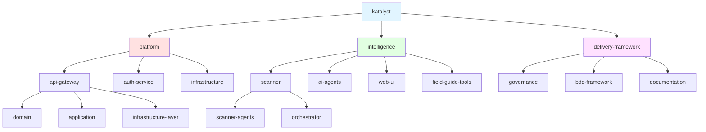

# System Hierarchy

This document defines the hierarchical structure of systems, subsystems, stacks, and layers within the Katalyst ecosystem.

## System Tree Visualization



## Node Types

The taxonomy supports six distinct node types:

### 1. System
**Purpose**: Top-level organizational boundary  
**Example**: `katalyst`  
**Characteristics**:
- Root of the hierarchy
- Represents the entire product/platform
- Usually maps to a business domain
- Has no parent node

### 2. Subsystem
**Purpose**: Major functional area within a system  
**Examples**: `platform`, `intelligence`, `delivery-framework`  
**Characteristics**:
- Major architectural subdivisions
- Often maps to bounded contexts (DDD)
- Can contain multiple stacks
- Typically owned by a single team

### 3. Stack
**Purpose**: Technology stack or service group  
**Examples**: `api-gateway`, `scanner`, `web-ui`  
**Characteristics**:
- Deployable units
- Technology-specific (e.g., Node.js API, React app)
- Contains architectural layers
- Has clear boundaries and interfaces

### 4. Layer
**Purpose**: Architectural layer within a stack  
**Examples**: `domain`, `application`, `infrastructure`  
**Characteristics**:
- Follows hexagonal/clean architecture patterns
- Layer-specific responsibilities
- Enforces dependency direction
- Not independently deployable

### 5. User
**Purpose**: End user or service account  
**Examples**: `admin-user`, `scanner-bot`, `api-client`  
**Characteristics**:
- Interacts with systems
- Has permissions and roles
- Can be human or automated
- Tracked for audit purposes

### 6. Org Unit
**Purpose**: Organizational unit (team, department)  
**Examples**: `platform-team`, `delivery-team`, `intelligence-team`  
**Characteristics**:
- Maps to real organizational structure
- Owns systems/subsystems
- Has decision-making authority
- Accountable for SLAs

---

## Fully Qualified Taxonomy Names (FQTN)

### Naming Convention

FQTNs follow Kubernetes naming conventions:

```
{node-name}.{parent-node}.{ancestor}...{root}
```

**Rules**:
- **Kebab-case**: All lowercase with hyphens (e.g., `api-gateway`)
- **Max 63 chars**: Each component ≤ 63 characters
- **DNS-safe**: Matches regex `^[a-z0-9]([-a-z0-9]{0,61}[a-z0-9])?$`
- **No special chars**: Only `a-z`, `0-9`, and `-`
- **Cannot start/end with hyphen**: Must begin and end with alphanumeric

### FQTN Examples

| FQTN | Node Type | Description |
|------|-----------|-------------|
| `katalyst` | system | Root system |
| `platform.katalyst` | subsystem | Platform subsystem |
| `api-gateway.platform.katalyst` | stack | API gateway service |
| `domain.api-gateway.platform.katalyst` | layer | Domain layer of API gateway |
| `governance.delivery-framework.katalyst` | stack | Governance tooling |
| `scanner.intelligence.katalyst` | stack | FOE scanner |
| `orchestrator.scanner.intelligence.katalyst` | stack | Scanner orchestrator |

### FQTN Validation

All FQTNs must pass validation against the schema:

```typescript
import { TaxonomyNodeNamePattern } from '@foe/schemas/taxonomy/taxonomy-snapshot';

// Valid FQTNs
TaxonomyNodeNamePattern.parse('katalyst'); // ✓
TaxonomyNodeNamePattern.parse('api-gateway'); // ✓
TaxonomyNodeNamePattern.parse('auth-service-v2'); // ✓

// Invalid FQTNs
TaxonomyNodeNamePattern.parse('API_Gateway'); // ✗ (uppercase, underscore)
TaxonomyNodeNamePattern.parse('api-gateway-'); // ✗ (ends with hyphen)
TaxonomyNodeNamePattern.parse('-api-gateway'); // ✗ (starts with hyphen)
```

---

## Complete System Hierarchy

### Root: `katalyst`
**Type**: system  
**Description**: Katalyst Delivery Framework root system  
**Owner**: Engineering Leadership

---

### Subsystem: `platform.katalyst`
**Type**: subsystem  
**Description**: Core platform services and infrastructure  
**Owner**: Platform Team  
**Stacks**:

#### `api-gateway.platform.katalyst`
- **Type**: stack
- **Tech**: Elysia (TypeScript)
- **Purpose**: REST API gateway for all services
- **Layers**:
  - `domain.api-gateway.platform.katalyst` (Domain logic)
  - `application.api-gateway.platform.katalyst` (Use cases)
  - `infrastructure.api-gateway.platform.katalyst` (Database, HTTP)
- **Endpoints**: `/v1/domains`, `/v1/contexts`, `/v1/aggregates`, etc.
- **Deployment**: Docker container on AWS ECS

#### `auth-service.platform.katalyst`
- **Type**: stack
- **Tech**: Elysia (TypeScript)
- **Purpose**: Authentication and authorization service
- **Layers**:
  - `domain.auth-service.platform.katalyst`
  - `application.auth-service.platform.katalyst`
  - `infrastructure.auth-service.platform.katalyst`
- **Features**: JWT tokens, API keys, session management
- **Deployment**: Docker container on AWS ECS

#### `infrastructure.platform.katalyst`
- **Type**: stack
- **Tech**: PostgreSQL, Redis, S3
- **Purpose**: Shared infrastructure services
- **Components**:
  - `database.infrastructure.platform.katalyst` (PostgreSQL)
  - `cache.infrastructure.platform.katalyst` (Redis)
  - `storage.infrastructure.platform.katalyst` (S3)
- **Managed By**: DevOps Team

---

### Subsystem: `intelligence.katalyst`
**Type**: subsystem  
**Description**: AI-powered scanning and analysis tools  
**Owner**: Intelligence Team  
**Stacks**:

#### `scanner.intelligence.katalyst`
- **Type**: stack
- **Tech**: Docker + OpenCode CLI
- **Purpose**: Repository scanning and FOE assessment
- **Components**:
  - `orchestrator.scanner.intelligence.katalyst` (Main coordinator)
  - `scanner-ci.intelligence.katalyst` (CI/CD analysis)
  - `scanner-tests.intelligence.katalyst` (Test analysis)
  - `scanner-arch.intelligence.katalyst` (Architecture analysis)
  - `scanner-domain.intelligence.katalyst` (Domain analysis)
  - `scanner-docs.intelligence.katalyst` (Documentation analysis)
- **Deployment**: Docker multi-stage build

#### `ai-agents.intelligence.katalyst`
- **Type**: stack
- **Tech**: OpenCode + Claude Sonnet 4.5
- **Purpose**: AI agent orchestration and execution
- **Agents**:
  - `bdd-writer.ai-agents.intelligence.katalyst`
  - `code-writer.ai-agents.intelligence.katalyst`
  - `architecture-inspector.ai-agents.intelligence.katalyst`
  - `ddd-aligner.ai-agents.intelligence.katalyst`
- **Deployment**: Local CLI

#### `field-guide-tools.intelligence.katalyst`
- **Type**: stack
- **Tech**: TypeScript
- **Purpose**: Field Guide parsing and indexing
- **Components**:
  - `parsers.field-guide-tools.intelligence.katalyst`
  - `builders.field-guide-tools.intelligence.katalyst`
  - `cli.field-guide-tools.intelligence.katalyst`
- **Output**: JSON indices (methods, observations, keywords)

#### `web-ui.intelligence.katalyst`
- **Type**: stack
- **Tech**: React 18 + Vite + Tailwind
- **Purpose**: FOE report visualization
- **Components**:
  - `report-viewer.web-ui.intelligence.katalyst`
  - `dimension-charts.web-ui.intelligence.katalyst`
  - `triangle-diagram.web-ui.intelligence.katalyst`
- **Deployment**: Static site (Netlify/Vercel)

---

### Subsystem: `delivery-framework.katalyst`
**Type**: subsystem  
**Description**: Governance and delivery tooling  
**Owner**: Delivery Team  
**Stacks**:

#### `governance.delivery-framework.katalyst`
- **Type**: stack
- **Tech**: Zod schemas + Markdown frontmatter
- **Purpose**: Governance artifact validation
- **Components**:
  - `schemas.governance.delivery-framework.katalyst` (Zod schemas)
  - `parsers.governance.delivery-framework.katalyst` (Markdown parsers)
  - `validators.governance.delivery-framework.katalyst` (Validation logic)
- **Artifacts**: ROAD items, ADRs, NFRs, user stories, capabilities

#### `bdd-framework.delivery-framework.katalyst`
- **Type**: stack
- **Tech**: Playwright-BDD + Gherkin
- **Purpose**: Behavior-driven development testing
- **Components**:
  - `features.bdd-framework.delivery-framework.katalyst` (Gherkin scenarios)
  - `steps.bdd-framework.delivery-framework.katalyst` (Step definitions)
  - `runners.bdd-framework.delivery-framework.katalyst` (Test execution)
- **Coverage**: API, UI, integration tests

#### `documentation.delivery-framework.katalyst`
- **Type**: stack
- **Tech**: Docusaurus 3.x
- **Purpose**: Governance documentation platform
- **Components**:
  - `sidebars.documentation.delivery-framework.katalyst` (Navigation)
  - `plugins.documentation.delivery-framework.katalyst` (Data loaders)
  - `components.documentation.delivery-framework.katalyst` (React components)
- **Deployment**: Static site (GitHub Pages)

---

## Layer Dependency Rules

Systems following hexagonal architecture must enforce these dependency rules:

```
UI Layer
  ↓ (depends on)
Application Layer
  ↓ (depends on)
Domain Layer (no dependencies on outer layers)
```

### Domain Layer
**FQTN Pattern**: `domain.{stack}.{subsystem}.katalyst`

**Rules**:
- ✅ Can import other domain modules
- ✅ Can define port interfaces (repositories, external services)
- ❌ CANNOT import application layer
- ❌ CANNOT import infrastructure layer
- ❌ CANNOT have direct I/O (database, HTTP, file system)
- ❌ CANNOT import external framework-specific code

**Example**:
```typescript
// ✅ GOOD: Pure domain logic
export class AdvertisementBot {
  sendAdvertisement(channel: string, message: string): AdvertisementSent {
    // Pure business logic
  }
}

// ❌ BAD: Domain importing infrastructure
import { Database } from '@infrastructure/database'; // VIOLATION
```

### Application Layer
**FQTN Pattern**: `application.{stack}.{subsystem}.katalyst`

**Rules**:
- ✅ Can import domain layer
- ✅ Can use port interfaces defined in domain
- ✅ Can orchestrate multiple domain operations
- ❌ CANNOT import infrastructure implementations
- ❌ CANNOT have direct I/O operations

**Example**:
```typescript
// ✅ GOOD: Application service using ports
export class BotService {
  constructor(private botRepo: BotRepository) {} // Port from domain
  
  async createBot(data: CreateBotInput): Promise<Bot> {
    // Orchestration logic
  }
}
```

### Infrastructure Layer
**FQTN Pattern**: `infrastructure.{stack}.{subsystem}.katalyst`

**Rules**:
- ✅ Can import domain ports
- ✅ Implements adapters for ports
- ✅ Can have direct I/O operations
- ❌ CANNOT be imported by domain or application

**Example**:
```typescript
// ✅ GOOD: Infrastructure implementing domain port
export class PostgresBotRepository implements BotRepository {
  async save(bot: Bot): Promise<void> {
    await this.db.insert(bots).values(bot);
  }
}
```

---

## Integration with @foe/schemas

All taxonomy nodes are validated against Zod schemas:

```typescript
import { 
  TaxonomyNodeSchema,
  TaxonomyNodeTypeSchema,
  TaxonomyNodeNamePattern 
} from '@foe/schemas/taxonomy/taxonomy-snapshot';

// Example: Validate a taxonomy node
const apiGatewayNode = {
  name: 'api-gateway',
  nodeType: 'stack' as const,
  fqtn: 'api-gateway.platform.katalyst',
  description: 'REST API gateway for all services',
  parentNode: 'platform.katalyst',
  owners: ['platform-team'],
  environments: ['dev', 'staging', 'prod'],
  labels: {
    tech: 'elysia',
    language: 'typescript',
    deploymentTarget: 'aws-ecs',
  },
  dependsOn: ['auth-service.platform.katalyst'],
};

// Validate
const result = TaxonomyNodeSchema.safeParse(apiGatewayNode);
if (result.success) {
  console.log('✓ Valid taxonomy node');
} else {
  console.error('✗ Validation errors:', result.error);
}
```

---

## Adding New Nodes

### Checklist

Before adding a new node to the taxonomy:

- [ ] Choose appropriate node type (system, subsystem, stack, layer, user, org_unit)
- [ ] Define valid FQTN following naming conventions
- [ ] Identify parent node
- [ ] Assign owning team(s)
- [ ] Define environments (if applicable)
- [ ] Document dependencies
- [ ] Update dependency graph
- [ ] Update capability mapping (if providing capabilities)
- [ ] Add to this documentation
- [ ] Create ADR if introducing new subsystem
- [ ] Validate against `@foe/schemas/taxonomy`

### Example: Adding a New Service

**Scenario**: Adding a "notification-service" to the platform subsystem

1. **Choose node type**: `stack` (deployable service)
2. **Define FQTN**: `notification-service.platform.katalyst`
3. **Parent node**: `platform.katalyst`
4. **Owner**: Platform Team
5. **Environments**: dev, staging, prod
6. **Dependencies**: 
   - `auth-service.platform.katalyst` (for authentication)
   - `database.infrastructure.platform.katalyst` (for persistence)
7. **Layers**:
   - `domain.notification-service.platform.katalyst`
   - `application.notification-service.platform.katalyst`
   - `infrastructure.notification-service.platform.katalyst`
8. **Update docs**: Add to system hierarchy, dependency graph, capability mapping
9. **Create ADR**: ADR-XXX: Add Notification Service to Platform

---

**Last Updated**: 2026-02-16  
**Maintained By**: Platform Team  
**Version**: 1.0.0
