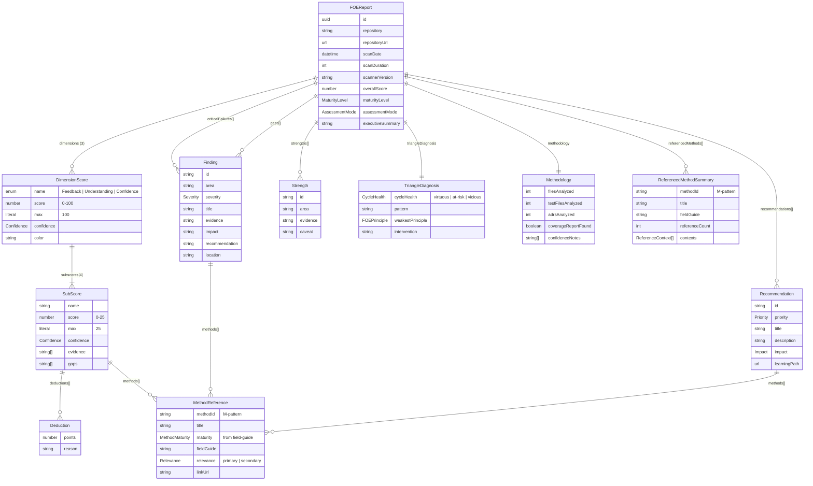
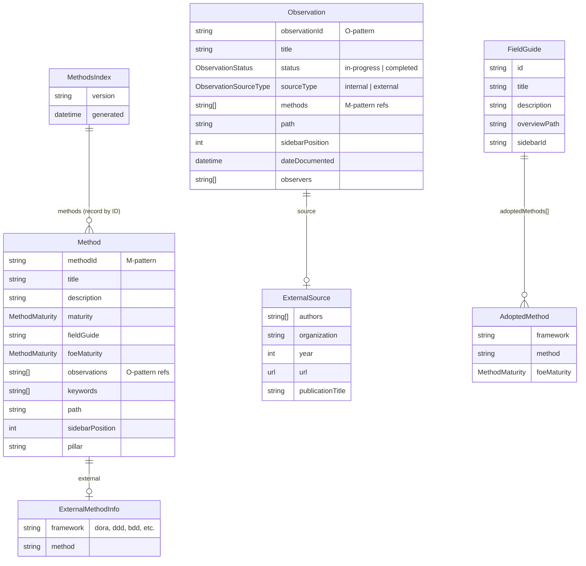
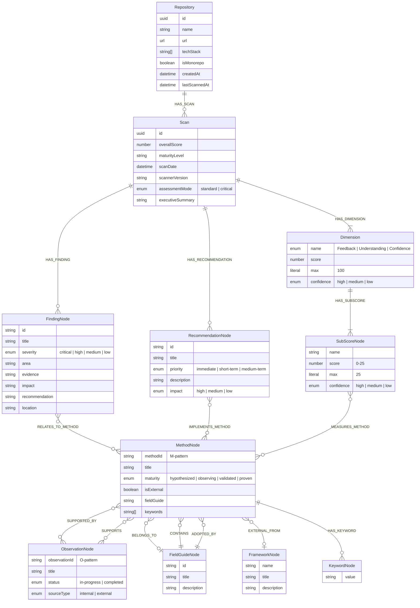
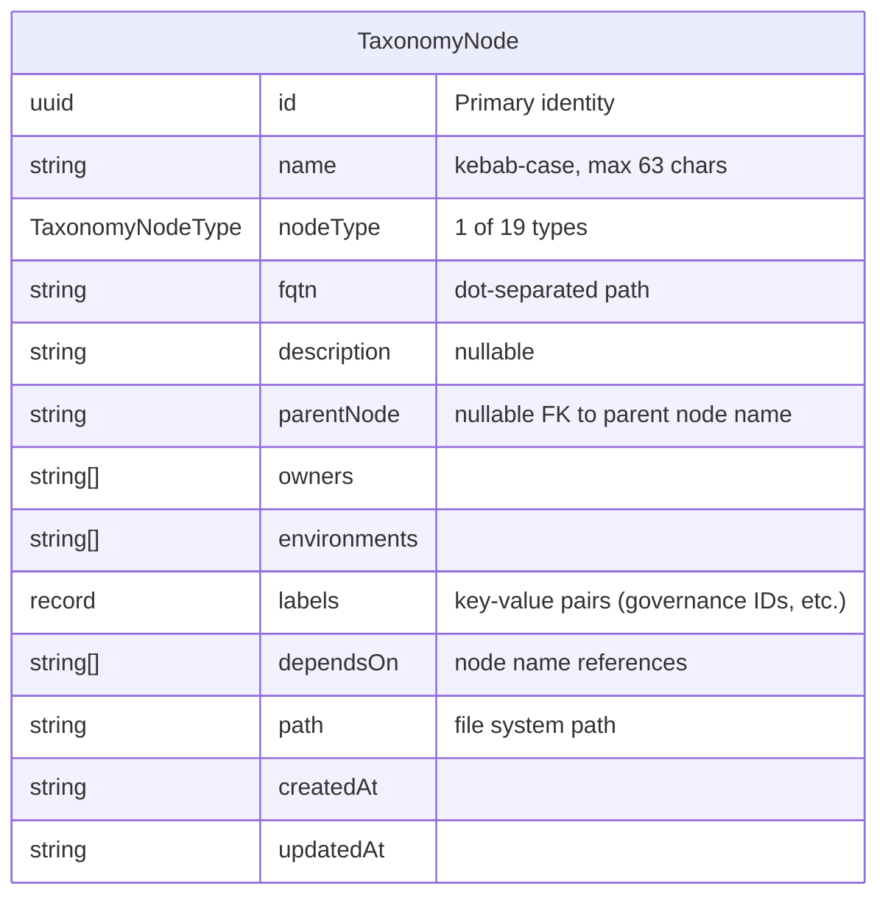
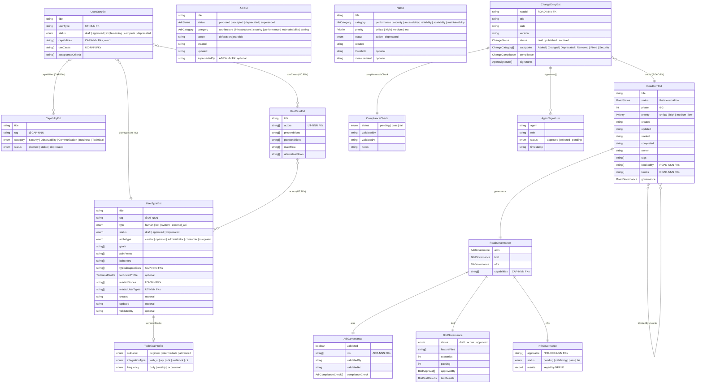
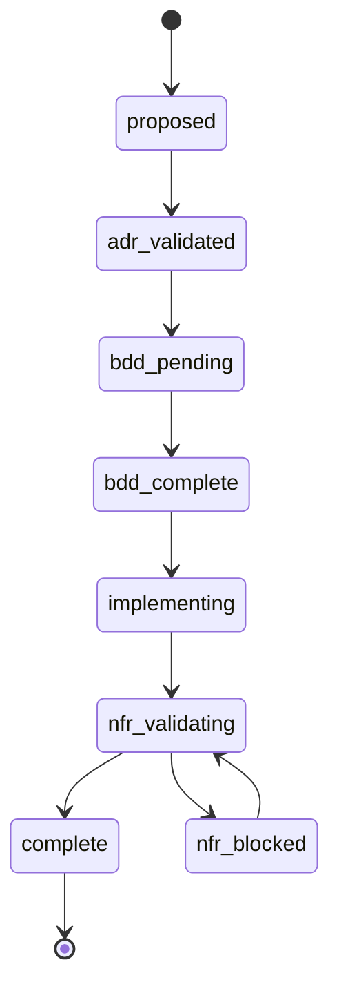

# @foe/schemas v0.2.0 - Entity Relationship Diagrams

Visual documentation of the Zod schema data model across all 4 modules.

**Rendering:** These are [Mermaid](https://mermaid.js.org/) diagrams. GitHub renders them natively. For local viewing, use a Mermaid-compatible editor or VS Code extension.

---

## 1. High-Level Module Overview

Shows the 4 schema modules, their apex (root) schemas, and cross-module dependencies.

```mermaid
graph TB
  subgraph scan["scan/ (FOE Report Pipeline)"]
    direction TB
    FOEReport["FOEReportSchema<br/><i>apex</i>"]
  end

  subgraph fg["field-guide/ (Method & Observation Definitions)"]
    direction TB
    MethodsIndex["MethodsIndexSchema<br/><i>apex</i>"]
    MethodMaturity["MethodMaturitySchema<br/><i>shared enum</i>"]
  end

  subgraph graph["graph/ (Neo4j Knowledge Graph)"]
    direction TB
    GraphNode["GraphNodeSchema<br/><i>discriminated union of 11 nodes</i>"]
  end

  subgraph tax["taxonomy/ (Unified DDD + Governance + Infrastructure)"]
    direction TB
    TaxSnapshot["TaxonomySnapshotSchema<br/><i>apex</i>"]
    subgraph taxcore["Base Node + Extensions"]
      TaxNode["TaxonomyNodeSchema<br/><i>19 node types</i>"]
      TaxExt["NodeExtensionsSchema<br/><i>13 typed extensions</i>"]
    end
    LayerHealth["LayerHealthSchema"]
  end

  %% The one cross-module import
  MethodMaturity -->|"imports"| FOEReport

  %% Annotations
  style scan fill:#dbeafe,stroke:#3b82f6,color:#1e3a5f
  style fg fill:#ffedd5,stroke:#f97316,color:#7c2d12
  style graph fill:#f3f4f6,stroke:#6b7280,color:#1f2937
  style tax fill:#ccfbf1,stroke:#14b8a6,color:#134e4a
```

### Key observations

- **Only 1 cross-module import exists:** `scan/method-reference.ts` imports `MethodMaturitySchema` from `field-guide/method.ts`
- **`graph/` is fully isolated** — duplicates 12+ inline enums rather than importing from other modules
- **`taxonomy/` is fully isolated** — no imports from or exports consumed by other modules
- **Single unified DDD + Governance model:** the former `ddd/` (UUID-based) and `governance/` (slug-based) modules have been consolidated into `taxonomy/` using a **Base Node + Typed Extensions** architecture
- **Two apex schemas** compose the data model: `FOEReportSchema` (scan pipeline) and `TaxonomySnapshotSchema` (unified project taxonomy)

---

## 2. scan/ — FOE Report Pipeline

The core output schema. `FOEReportSchema` composes 8 sub-schemas plus shared enums.



### Shared enums (scan/common.ts)

| Enum | Values | Used by |
|------|--------|---------|
| `ConfidenceSchema` | high, medium, low | DimensionScore, SubScore |
| `SeveritySchema` | critical, high, medium, low | Finding |
| `MaturityLevelSchema` | Hypothesized, Emerging, Practicing, Optimized | FOEReport |
| `AssessmentModeSchema` | standard, critical | FOEReport |
| `PrioritySchema` | immediate, short-term, medium-term | Recommendation |
| `ImpactSchema` | high, medium, low | Recommendation |

### Cross-module bridge

`MethodReference.maturity` uses `MethodMaturitySchema` imported from `field-guide/method.ts` — the **only cross-module dependency** in the entire schema package.

---

## 3. field-guide/ — Method & Observation Definitions

Schemas that mirror Field Guide markdown frontmatter. Used at build time to validate and index methods.



### Shared enums (field-guide/)

| Enum | Values | Defined in |
|------|--------|-----------|
| `MethodMaturitySchema` | hypothesized, observing, validated, proven | method.ts |
| `ObservationStatusSchema` | in-progress, completed | observation.ts |
| `ObservationSourceTypeSchema` | internal, external | observation.ts |

---

## 4. graph/ — Neo4j Knowledge Graph

Fully isolated module. Defines 11 node types as a discriminated union and 15 relationship types.



### GraphNodeSchema (discriminated union)

All 11 node types are combined into a single discriminated union on the `_label` field:

```typescript
GraphNodeSchema = z.discriminatedUnion("_label", [
  RepositoryNodeSchema.extend({ _label: z.literal("Repository") }),
  ScanNodeSchema.extend({ _label: z.literal("Scan") }),
  // ... 9 more
]);
```

### Relationship properties

| Relationship | Properties Schema |
|-------------|-------------------|
| `RELATES_TO_METHOD` | `{ relevance: primary\|secondary, context: subscore\|finding\|recommendation }` |
| `MEASURES_METHOD` | `{ relevance: primary\|secondary }` |
| `EXTERNAL_FROM` | `{ method: string }` |
| `ADOPTED_BY` | `{ foeMaturity: hypothesized\|observing\|validated\|proven }` |
| `HAS_SCAN` | `{ scannedAt: datetime }` |
| All others | No typed properties |

---

## 5. taxonomy/ — Unified DDD + Governance + Infrastructure

The **single source of truth** for the entire project taxonomy. Replaces the former `ddd/` (UUID-based domain modeling) and `governance/` (slug-based workflow lifecycle) modules with a unified **Base Node + Typed Extensions** architecture.

### 5.1 Architectural pattern

Every entity in the taxonomy — whether infrastructure, DDD, or governance — is a `TaxonomyNode`. Domain/governance-specific fields live in **typed extension schemas**, stored separately and keyed by the node's UUID.

```
TaxonomySnapshotSchema (root)
├── nodes: Record<UUID, TaxonomyNode>         ← universal base for all 19 types
├── extensions: NodeExtensionsSchema           ← domain-specific data by UUID
│   ├── boundedContexts: Record<UUID, BoundedContextExt>
│   ├── aggregates: Record<UUID, AggregateExt>
│   ├── ... (13 extension maps total)
│   └── changeEntries: Record<UUID, ChangeEntryExt>
├── environments: Record<name, TaxonomyEnvironment>
├── layerTypes / infraCapabilities / capabilityRels / actions / stages / tools / persons / teams
├── layerHealths: Record<name, LayerHealth>
├── reverseIndices: ReverseIndicesSchema       ← fast governance lookups
├── pluginSummary: TaxonomyPluginSummary       ← count summary
└── stats: TaxonomyStatsSchema                 ← aggregate statistics
```

### 5.2 Identity model

| Identifier | Format | Role |
|-----------|--------|------|
| **UUID** (`id`) | `550e8400-e29b-...` | Primary identity, used as record key in `nodes` and `extensions` |
| **Name** (`name`) | `order-service` | Kebab-case human-readable slug (max 63 chars) |
| **FQTN** (`fqtn`) | `system.subsystem.layer` | Fully-qualified taxonomy name (dot-separated path) |
| **Governance ID** | `CAP-001`, `ROAD-042` | Stored in `labels` record for reverse-index lookups |

### 5.3 TaxonomyNodeSchema — Base node

Every entity starts here. Infrastructure node types (system, subsystem, stack, layer, user, org_unit) use **only** the base node. DDD/governance types additionally carry a typed extension.



### 5.4 TaxonomyNodeType — 19 values

| Category | Node Types | Extension Schema |
|----------|-----------|-----------------|
| **Infrastructure** | `system`, `subsystem`, `stack`, `layer`, `user`, `org_unit` | _(base node only)_ |
| **DDD** | `bounded_context`, `aggregate`, `value_object`, `domain_event`, `glossary_term` | `BoundedContextExt`, `AggregateExt`, `ValueObjectExt`, `DomainEventExt`, `GlossaryTermExt` |
| **Governance** | `capability`, `user type`, `user_story`, `use_case`, `road_item`, `adr`, `nfr`, `change_entry` | `CapabilityExt`, `UserTypeExt`, `UserStoryExt`, `UseCaseExt`, `RoadItemExt`, `AdrExt`, `NfrExt`, `ChangeEntryExt` |

### 5.5 Extension schemas — DDD

```mermaid
erDiagram
    BoundedContextExt {
        string responsibility
        string sourceDirectory "optional"
        slug[] aggregates
        ContextRelationship[] relationships
        CommunicationPattern communicationPattern "default: domain-events"
        slug[] upstreamContexts
        slug[] downstreamContexts
        string teamOwnership "optional"
        string ownerTeam "optional"
        enum status "draft | stable | deprecated"
        SubdomainType subdomainType "core | supporting | generic | null"
        ContextType contextType "internal | external-system | human-process | unknown"
    }

    ContextRelationship {
        string targetContext
        enum type "upstream | downstream | partnership | shared-kernel | separate-ways"
        CommunicationPattern communicationPattern "optional"
        string description "optional"
    }

    AggregateExt {
        slug context "FK to bounded context name"
        string rootEntity
        string[] entities
        slug[] valueObjects
        slug[] events
        string[] commands
        Invariant[] invariants
        string sourceFile "optional"
        enum status "draft | implemented | deprecated"
    }

    Invariant {
        string description
        boolean enforced "default: false"
        string enforcementLocation "optional"
    }

    ValueObjectExt {
        slug context "FK to bounded context name"
        ValueObjectProperty[] properties
        string[] validationRules
        boolean immutable "default: true"
        string sourceFile "optional"
    }

    ValueObjectProperty {
        string name
        string type
        string constraints "optional"
    }

    DomainEventExt {
        slug context "FK to bounded context name"
        slug aggregate "FK to aggregate name, optional"
        EventPayloadField[] payload
        slug[] consumedBy
        string[] triggers
        string[] sideEffects
        string sourceFile "optional"
        string sourceCapabilityId "optional"
        string[] targetCapabilityIds
    }

    EventPayloadField {
        string name
        string type
        string description "optional"
    }

    GlossaryTermExt {
        string term
        string definition
        uuid contextId "optional FK to bounded context"
        string[] aliases
        string[] examples
        string[] relatedTerms
        string source "optional"
    }

    BoundedContextExt ||--o{ ContextRelationship : "relationships[]"
    AggregateExt ||--o{ Invariant : "invariants[]"
    ValueObjectExt ||--o{ ValueObjectProperty : "properties[]"
    DomainEventExt ||--o{ EventPayloadField : "payload[]"
```



### 5.6 Extension schemas — Governance



### 5.7 RoadItem state machine



Transition validation is enforced via `STATE_MACHINE_TRANSITIONS` map and `validateTransition()` / `getNextStates()` helper functions.

### 5.8 TaxonomySnapshotSchema — Root schema

```mermaid
erDiagram
    TaxonomySnapshot {
        uuid id
        string project
        string version
        string generated
        string createdAt
    }

    TaxonomyNode {
        uuid id
        string name
        TaxonomyNodeType nodeType
        string fqtn
        string description
        string parentNode
        string[] owners
        string[] environments
        record labels
        string[] dependsOn
        string path
        string createdAt
        string updatedAt
    }

    TaxonomyEnvironment {
        string name "kebab-case"
        string description
        string parentEnvironment
        string[] promotionTargets
        record templateReplacements
    }

    TaxonomyLayerType {
        string name
        string description
        string defaultLayerDir
    }

    TaxonomyCapability_Infra {
        string name
        string description
        string[] categories
        string[] dependsOnCapabilities
    }

    TaxonomyCapabilityRel {
        string name
        string node
        enum relationshipType "supports | depends-on | implements | enables"
        string[] capabilities
    }

    TaxonomyAction {
        string name
        ActionType actionType "shell | http | workflow"
        string layerType
        string[] tags
    }

    TaxonomyStage {
        string name
        string description
        string[] dependsOn
    }

    TaxonomyTool {
        string name
        string description
        string[] actions
    }

    TaxonomyPerson {
        string name
        string displayName
        string email
        string role
        string avatarUrl
    }

    TaxonomyTeam {
        string name
        string displayName
        TeamTopologyType teamType "stream-aligned | platform | enabling | complicated-subsystem"
        string description
        string focusArea
        string[] communicationChannels
        string[] ownedNodes
        TaxonomyTeamMembership[] members
    }

    TaxonomyTeamMembership {
        string personName
        string role
    }

    NodeExtensions {
        record boundedContexts "UUID -> BoundedContextExt"
        record aggregates "UUID -> AggregateExt"
        record valueObjects "UUID -> ValueObjectExt"
        record domainEvents "UUID -> DomainEventExt"
        record glossaryTerms "UUID -> GlossaryTermExt"
        record capabilities "UUID -> CapabilityExt"
        record userTypes "UUID -> UserTypeExt"
        record userStories "UUID -> UserStoryExt"
        record useCases "UUID -> UseCaseExt"
        record roadItems "UUID -> RoadItemExt"
        record adrs "UUID -> AdrExt"
        record nfrs "UUID -> NfrExt"
        record changeEntries "UUID -> ChangeEntryExt"
    }

    TaxonomyPluginSummary {
        int layerTypes
        int capabilities
        int capabilityRels
        int actions
        int stages
        int tools
        int layerHealths
        int teams
        int persons
    }

    ReverseIndices {
        record byCapability "CAP-NNN -> user types, stories, roads"
        record byUserType "UT-NNN -> stories, capabilities"
        record byRoad "ROAD-NNN -> adrs, changes, capabilities, nfrs"
        record byContext "slug -> aggregates, events, valueObjects, roads"
        record byAggregate "slug -> context, valueObjects, events"
    }

    TaxonomyStats {
        int totalNodes
        int totalEnvironments
        int totalCapabilities
        int totalUserTypes
        int totalStories
        int totalUseCases
        int totalRoadItems
        int totalAdrs
        int totalNfrs
        int totalChanges
        int totalContexts
        int totalAggregates
        int totalValueObjects
        int totalDomainEvents
        int totalGlossaryTerms
        record roadsByStatus
        record roadsByPhase
        ReferentialIntegrity referentialIntegrity
    }

    LayerHealth {
        string layerNode "FK to TaxonomyNode"
        number overallScore "0-100"
        HealthStatus overallStatus "pass | warn | fail"
    }

    UnderstandabilityCategory {
        number score "0-100"
        HealthStatus status
        UnderstandabilityMetrics metrics
        string[] nfrIds
        string[] adrIds
    }

    FunctionalityCategory {
        number score "0-100"
        HealthStatus status
        FunctionalityMetrics metrics
        string[] nfrIds
        string[] adrIds
    }

    ComplianceCategory {
        number score "0-100"
        HealthStatus status
        ComplianceMetrics metrics
        string[] nfrIds
        string[] adrIds
    }

    TaxonomySnapshot ||--o{ TaxonomyNode : "nodes (Record by UUID)"
    TaxonomySnapshot ||--o{ TaxonomyEnvironment : "environments (Record)"
    TaxonomySnapshot ||--o{ TaxonomyLayerType : "layerTypes (Record)"
    TaxonomySnapshot ||--o{ TaxonomyCapability_Infra : "infraCapabilities (Record)"
    TaxonomySnapshot ||--o{ TaxonomyCapabilityRel : "capabilityRels (Record)"
    TaxonomySnapshot ||--o{ TaxonomyAction : "actions (Record)"
    TaxonomySnapshot ||--o{ TaxonomyStage : "stages (Record)"
    TaxonomySnapshot ||--o{ TaxonomyTool : "tools (Record)"
    TaxonomySnapshot ||--o{ TaxonomyPerson : "persons (Record)"
    TaxonomySnapshot ||--o{ TaxonomyTeam : "teams (Record)"
    TaxonomySnapshot ||--|| NodeExtensions : "extensions"
    TaxonomySnapshot ||--o{ LayerHealth : "layerHealths (Record)"
    TaxonomySnapshot ||--|| TaxonomyPluginSummary : "pluginSummary"
    TaxonomySnapshot ||--|| ReverseIndices : "reverseIndices"
    TaxonomySnapshot ||--|| TaxonomyStats : "stats"

    TaxonomyTeam ||--o{ TaxonomyTeamMembership : "members[]"

    LayerHealth ||--|| UnderstandabilityCategory : "understandability"
    LayerHealth ||--|| FunctionalityCategory : "functionality"
    LayerHealth ||--|| ComplianceCategory : "compliance"
```



### 5.9 NodeExtensions — Record structure

The `NodeExtensionsSchema` is a flat object with 13 record fields, one per extension type. Each record maps a node UUID to its typed extension data. Only nodes with domain/governance-specific data have entries.

```typescript
NodeExtensionsSchema = z.object({
  boundedContexts: z.record(BoundedContextExtSchema).default({}),
  aggregates:      z.record(AggregateExtSchema).default({}),
  valueObjects:    z.record(ValueObjectExtSchema).default({}),
  domainEvents:    z.record(DomainEventExtSchema).default({}),
  glossaryTerms:   z.record(GlossaryTermExtSchema).default({}),
  capabilities:    z.record(CapabilityExtSchema).default({}),
   userTypes:        z.record(UserTypeExtSchema).default({}),
  userStories:     z.record(UserStoryExtSchema).default({}),
  useCases:        z.record(UseCaseExtSchema).default({}),
  roadItems:       z.record(RoadItemExtSchema).default({}),
  adrs:            z.record(AdrExtSchema).default({}),
  nfrs:            z.record(NfrExtSchema).default({}),
  changeEntries:   z.record(ChangeEntryExtSchema).default({}),
});
```

**Lookup pattern:**
```typescript
// Given a node with id "550e8400-..." and nodeType "aggregate"
const node = snapshot.nodes["550e8400-..."];
const ext  = snapshot.extensions.aggregates["550e8400-..."];
// node.name → "order-aggregate", ext.rootEntity → "Order"
```

### 5.10 ReverseIndices — Fast lookup structures

Precomputed indices for governance cross-references, migrated from the former `GovernanceIndexSchema`.

| Index Key | Record Key | Value Fields | Use Case |
|-----------|-----------|-------------|----------|
| `byCapability` | `CAP-NNN` | `user types[]`, `stories[]`, `roads[]` | "Which road items deliver this capability?" |
| `byUserType` | `UT-NNN` | `stories[]`, `capabilities[]` | "What capabilities does this user type need?" |
| `byRoad` | `ROAD-NNN` | `adrs[]`, `changes[]`, `capabilities[]`, `nfrs[]` | "What governance artifacts are attached to this road item?" |
| `byContext` | slug | `aggregates[]`, `events[]`, `valueObjects[]`, `roads[]` | "What DDD entities belong to this bounded context?" |
| `byAggregate` | slug | `context`, `valueObjects[]`, `events[]` | "What is the context and contents of this aggregate?" |

### 5.11 Shared enums and patterns (taxonomy/common.ts)

| Pattern/Enum | Example | Used by |
|-------------|---------|---------|
| `TaxonomyNodeNamePattern` | `order-service` | TaxonomyNode.name, all infrastructure schemas |
| `SlugPattern` | `my-context` | DDD extension schemas (context, aggregate, value-object, event refs) |
| `CapabilityIdPattern` | `CAP-001` | CapabilityExt, UserTypeExt, UserStoryExt, RoadItemExt, ReverseIndices |
| `UserTypeIdPattern` | `UT-001` | UserTypeExt, UserStoryExt, UseCaseExt, ReverseIndices |
| `UserStoryIdPattern` | `US-001` | UserStoryExt, UserTypeExt, ReverseIndices |
| `UseCaseIdPattern` | `UC-001` | UseCaseExt, UserStoryExt |
| `RoadItemIdPattern` | `ROAD-001` | RoadItemExt, ChangeEntryExt, ReverseIndices |
| `AdrIdPattern` | `ADR-001` | AdrExt, RoadItemExt (AdrGovernance), ReverseIndices |
| `NfrIdPattern` | `NFR-SEC-001` | NfrExt, RoadItemExt (NfrGovernance), ReverseIndices |
| `ChangeIdPattern` | `CHANGE-001` | ChangeEntryExt, ReverseIndices |
| `PrioritySchema` | critical, high, medium, low | RoadItemExt, NfrExt |
| `GovernancePhaseSchema` | 0–3 | RoadItemExt |

### 5.12 Infrastructure schemas (taxonomy-node.ts)

These schemas define infrastructure-level entities that are stored as collections on the snapshot, **not** as typed extensions:

| Schema | Key Fields | Stored in |
|--------|-----------|-----------|
| `TaxonomyEnvironmentSchema` | name, description, parentEnvironment, promotionTargets, templateReplacements | `snapshot.environments` |
| `TaxonomyLayerTypeSchema` | name, description, defaultLayerDir | `snapshot.layerTypes` |
| `TaxonomyCapabilitySchema` | name, description, categories, dependsOnCapabilities | `snapshot.infraCapabilities` |
| `TaxonomyCapabilityRelSchema` | name, node, relationshipType, capabilities | `snapshot.capabilityRels` |
| `TaxonomyActionSchema` | name, actionType, layerType, tags | `snapshot.actions` |
| `TaxonomyStageSchema` | name, description, dependsOn | `snapshot.stages` |
| `TaxonomyToolSchema` | name, description, actions | `snapshot.tools` |
| `TaxonomyPersonSchema` | name, displayName, email, role, avatarUrl | `snapshot.persons` |
| `TaxonomyTeamSchema` | name, displayName, teamType, description, focusArea, ownedNodes, members | `snapshot.teams` |

Additional enums:
| Enum | Values | Defined in |
|------|--------|-----------|
| `CapabilityRelationshipTypeSchema` | supports, depends-on, implements, enables | taxonomy-node.ts |
| `TeamTopologyTypeSchema` | stream-aligned, platform, enabling, complicated-subsystem | taxonomy-node.ts |
| `ActionTypeSchema` | shell, http, workflow | taxonomy-node.ts |
| `HealthStatusSchema` | pass, warn, fail | layer-health.ts |
| `HealthCategorySchema` | understandability, functionality, compliance | layer-health.ts |

### 5.13 Helper functions

| Function | Signature | Description |
|----------|----------|-------------|
| `getRoadsByCapability` | `(snapshot, capId) → string[]` | Road item names by capability ID |
| `getUserTypesByCapability` | `(snapshot, capId) → string[]` | User type names by capability ID |
| `getCapabilityCoverage` | `(snapshot) → Record<string, number>` | Count of roads per capability |
| `getAggregatesByContext` | `(snapshot, contextSlug) → string[]` | Aggregate slugs by bounded context |
| `getEventsByContext` | `(snapshot, contextSlug) → string[]` | Domain event slugs by bounded context |
| `validateTransition` | `(from, to) → boolean` | Validate RoadItem state transition |
| `getNextStates` | `(current) → RoadStatus[]` | Get valid next states for a RoadItem |
