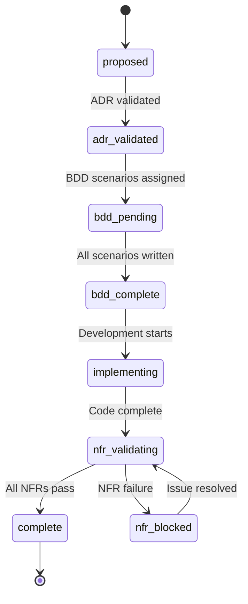
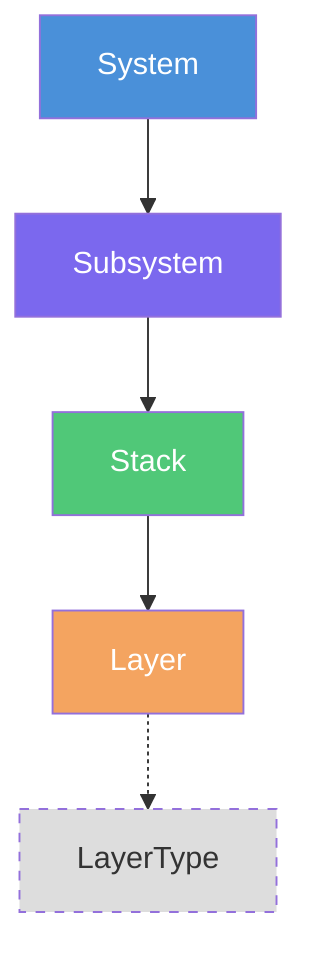

# Katalyst Platform - Complete Data Model

> Combined schema reference for **katalyst-domain-mapper** (governance, DDD) and **katalyst-taxonomy** (infrastructure taxonomy, plugins, agents).
>
> Domain Mapper source: `packages/foe-schemas/src/governance/` and `packages/foe-schemas/src/ddd/`
> Taxonomy source: `katalyst-taxonomy/src/katalyst_taxonomy/` and `katalyst-taxonomy/schemas/`

```mermaid
erDiagram

    %% ============================================================
    %% DOMAIN MAPPER - PRIMARY GOVERNANCE ARTIFACTS
    %% ============================================================

    RoadItem {
        string id "PK - ROAD-ddd pattern"
        string title
        RoadStatus status "proposed|adr_validated|bdd_pending|bdd_complete|implementing|nfr_validating|nfr_blocked|complete"
        int phase "0=Foundation 1=Core 2=Advanced 3=Future"
        Priority priority "critical|high|medium|low"
        string created "date"
        string updated "date"
        string started "optional date"
        string completed "optional date"
        string owner "optional"
        string_arr tags "default empty"
        string_arr dependsOn "ROAD-ddd refs"
        string_arr blockedBy "ROAD-ddd refs"
        string_arr blocks "ROAD-ddd refs"
        string path "auto-generated"
    }

    AdrGovernance {
        bool validated "default false"
        string_arr ids "ADR-ddd refs"
        string validatedBy "optional"
        string validatedAt "optional"
    }

    AdrComplianceEntry {
        string adr "ADR-ddd ref"
        bool compliant
        string notes "optional"
    }

    BddGovernance {
        BddStatus status "draft|active|approved"
        string_arr featureFiles "default empty"
        int scenarios "default 0"
        int passing "default 0"
    }

    BddApproval {
        string agent
        string timestamp
    }

    BddTestResults {
        int total "default 0"
        int passed "default 0"
        int failed "default 0"
        string coverage "default 0pct"
    }

    NfrGovernance {
        string_arr applicable "NFR-XXX-ddd refs"
        NfrGovStatus status "pending|validating|pass|fail"
    }

    NfrResult {
        NfrResultStatus status "pending|pass|fail"
        string evidence "optional"
        string validatedBy "optional"
        string timestamp "optional"
    }

    ADR {
        string id "PK - ADR-ddd pattern"
        string title
        AdrStatus status "proposed|accepted|deprecated|superseded"
        AdrCategory category "architecture|infrastructure|security|performance"
        string scope "default project-wide"
        string created "date"
        string updated "date"
        string supersededBy "optional ADR-ddd ref"
        string path "auto-generated"
    }

    NFR {
        string id "PK - NFR-XXX-ddd pattern"
        string title
        NfrCategory category "performance|security|accessibility|reliability|scalability|maintainability"
        Priority priority "critical|high|medium|low (mapped from MoSCoW)"
        NfrStatus status "active|deprecated"
        string created "date"
        string threshold "optional"
        string measurement "optional"
        string path "auto-generated"
    }

    Capability {
        string id "PK - CAP-ddd pattern"
        string title
        string tag "at-CAP-ddd pattern"
        CapCategory category "Security|Observability|Communication|Business|Technical"
        CapStatus status "planned|stable|deprecated"
        string description "optional"
        string path "auto-generated"
    }

    UserStory {
        string id "PK - US-ddd pattern"
        string title
        string persona "FK - PER-ddd ref"
        USStatus status "draft|approved|implementing|complete|deprecated"
        string_arr capabilities "CAP-ddd refs - min 1"
        string_arr useCases "UC-ddd refs - default empty"
        string_arr acceptanceCriteria "default empty"
        string path "auto-generated"
    }

    Persona {
        string id "PK - PER-ddd pattern"
        string name
        string tag "at-PER-ddd pattern"
        PersonaType type "human|bot|system|external_api"
        PersonaStatus status "draft|approved|deprecated"
        Archetype archetype "creator|operator|administrator|consumer|integrator"
        string description "optional"
        string_arr goals "default empty"
        string_arr painPoints "default empty"
        string_arr behaviors "default empty"
        string_arr typicalCapabilities "CAP-ddd refs"
        string_arr relatedStories "US-ddd refs"
        string_arr relatedPersonas "PER-ddd refs"
        string created "optional date"
        string updated "optional date"
        string validatedBy "optional"
        string path "auto-generated"
    }

    TechnicalProfile {
        SkillLevel skillLevel "beginner|intermediate|advanced"
        IntegrationType integrationType "web_ui|api|sdk|webhook|cli"
        Frequency frequency "daily|weekly|occasional"
    }

    UseCase {
        string id "PK - UC-ddd pattern"
        string title
        string description "optional"
        string_arr actors "PER-ddd refs"
        string_arr preconditions "default empty"
        string_arr postconditions "default empty"
        string_arr mainFlow "default empty"
        string_arr alternativeFlows "default empty"
        string path "auto-generated"
    }

    %% ============================================================
    %% DOMAIN MAPPER - CHANGE ENTRIES
    %% ============================================================

    ChangeEntry {
        string id "PK - CHANGE-ddd pattern"
        string roadId "FK - ROAD-ddd ref"
        string title
        string date "ISO date"
        string version "semver"
        ChangeStatus status "draft|published|archived"
        string_arr categories "Added|Changed|Deprecated|Removed|Fixed|Security - min 1"
        string path "auto-generated"
    }

    ComplianceAdrCheck {
        CheckStatus status "pending|pass|fail"
        string validatedBy "optional"
        string validatedAt "optional"
        string notes "optional"
    }

    ComplianceBddCheck {
        CheckStatus status "pending|pass|fail"
        int scenarios "default 0"
        int passed "default 0"
        string coverage "default 0pct"
    }

    ComplianceNfrCheck {
        NfrCheckStatus status "pending|pass|fail|na"
        string evidence "optional"
        string validatedBy "optional"
    }

    AgentSignature {
        string agent
        string role
        SigStatus status "approved|rejected|pending"
        string timestamp
    }

    %% ============================================================
    %% DOMAIN MAPPER - DDD ARTIFACTS (Merged: Governance + API)
    %% ============================================================

    BoundedContext {
        string id "PK - UUID (API only)"
        string slug "UK - lowercase-kebab"
        string title
        string description "optional"
        string responsibility
        string sourceDirectory "optional"
        string_arr aggregates "slug refs (gov) or string (API)"
        CommunicationPattern communicationPattern "domain-events|shared-kernel|acl|ohs|conformist|partnership|customer-supplier|separate-ways"
        string_arr upstreamContexts "slug refs (gov only)"
        string_arr downstreamContexts "slug refs (gov only)"
        string teamOwnership "optional"
        CtxStatus status "draft|stable|deprecated"
        SubdomainType subdomainType "nullable: core|supporting|generic"
        string path "gov only - auto-generated"
        datetime createdAt "API only"
        datetime updatedAt "API only"
    }

    ContextRelationship {
        string targetContext "slug or title"
        RelType type "upstream|downstream|partnership|shared-kernel|separate-ways"
        CommunicationPattern communicationPattern "optional"
        string description "optional"
    }

    Aggregate {
        string id "PK - UUID (API only)"
        string slug "UK - lowercase-kebab"
        string title
        string context "FK slug (gov)"
        string contextId "FK UUID (API only)"
        string rootEntity
        string_arr entities "default empty"
        string_arr valueObjects "slug refs (gov) or string (API)"
        string_arr events "slug refs (gov) or string (API)"
        string_arr commands "default empty"
        string sourceFile "optional"
        AggStatus status "draft|implemented|deprecated"
        string path "gov only - auto-generated"
        datetime createdAt "API only"
        datetime updatedAt "API only"
    }

    Invariant {
        string description
        bool enforced "default false"
        string enforcementLocation "optional"
    }

    ValueObject {
        string id "PK - UUID (API only)"
        string slug "UK - lowercase-kebab"
        string title
        string context "FK slug (gov)"
        string contextId "FK UUID (API only)"
        string description "optional"
        string_arr validationRules "default empty"
        bool immutable "default true"
        string sourceFile "optional"
        string path "gov only - auto-generated"
        datetime createdAt "API only"
        datetime updatedAt "API only"
    }

    VOProperty {
        string name
        string type
        string constraints "optional"
    }

    DomainEvent {
        string id "PK - UUID (API only)"
        string slug "UK - lowercase-kebab"
        string title
        string context "FK slug (gov)"
        string contextId "FK UUID (API only)"
        string aggregate "FK slug optional (gov)"
        string aggregateId "FK UUID optional (API only)"
        string description "optional"
        string_arr consumedBy "slug refs"
        string_arr triggers "default empty"
        string_arr sideEffects "default empty"
        string sourceFile "optional"
        string path "gov only - auto-generated"
        datetime createdAt "API only"
        datetime updatedAt "API only"
    }

    EventPayloadField {
        string name
        string type
        string description "optional"
    }

    %% ============================================================
    %% TAXONOMY - CORE HIERARCHY (K8s-style YAML documents)
    %% ============================================================

    TaxonomyDocument {
        string apiVersion "const: katalyst.taxonomy-v1alpha"
        string kind "const: TaxonomyNode"
        string name "PK - kebab-case max 63 chars"
        string taxonomyNodeType "system|subsystem|stack|layer|user|org_unit"
        string description "optional"
        string_arr owners "email format"
        map_str annotations "optional key-value"
        string layout "root|deep|by_kind|mixed_extensions (via annotations)"
        string_arr environments "min 1 - refs EnvironmentDocument.name"
        string_arr dependsOnNodes "refs other TaxonomyDocument.name"
        string parentNode "FK - refs TaxonomyDocument.name"
        map_str labels "optional key-value"
        map extensions "optional plugin-owned blocks"
        Path sourcePath "optional file origin"
    }

    TaxonomyNodeHierarchy {
        string system "kind=system - root level"
        string subsystem "kind=subsystem - parent must be system"
        string stack "kind=stack - parent must be subsystem"
        string layer "kind=layer - parent must be stack"
    }

    TaxonomyUserSpec {
        string userType "end_user|operator|auditor|etc"
        string_arr segments "optional cohort labels"
        string_arr responsibilities "primary goals"
        string_arr accessPatterns "journeys and capabilities"
    }

    TaxonomyOrgSpec {
        string unitType "division|department|team|etc"
        string_arr segments "optional"
        string_arr responsibilities "primary goals"
        string reportsTo "parent org unit ref"
        string_arr capabilities "competencies owned"
    }

    EnvironmentDocument {
        string apiVersion "const: katalyst.taxonomy-v1alpha"
        string kind "const: Environment"
        string name "PK - kebab-case max 63 chars"
        string description "optional"
        string accountAlias "optional"
        string region "optional"
        map_str tags "optional"
        string_arr promotionTargets "unique items"
        map_str templateReplacements "key-value for rendering"
        map layerTemplates "layer-type specific config"
        string parentEnvironment "optional FK - refs another Environment"
        Path sourcePath "optional file origin"
    }

    %% ============================================================
    %% TAXONOMY - LOCK FILE (Installed Components)
    %% ============================================================

    KatalystLock {
        string apiVersion "const: katalyst.taxonomy-v1alpha"
        string kind "const: KatalystLock"
        datetime generatedAt "ISO 8601"
        string generatedBy "e.g. kata init"
        string katalystVersion "semver"
    }

    InstalledCore {
        string version "semver"
        string schemaVersion "semver"
        datetime installedAt "ISO 8601"
        string source "default: bundled"
    }

    InstalledPlugin {
        string version "semver"
        datetime installedAt "ISO 8601"
        string source "default: bundled"
        string_arr canonical "built-in items"
        string_arr custom "user-defined items"
    }

    %% ============================================================
    %% TAXONOMY - PLUGINS
    %% ============================================================

    LayerType {
        string apiVersion "katalyst.taxonomy.plugins.layer_types-v1alpha"
        string kind "const: LayerType"
        string name "PK - kebab-case"
        string description "optional"
        Path templatePath "resolved directory"
        string defaultLayerDir "single dir segment"
        string_arr optionalPaths "glob patterns"
        Path path "source file"
        int documentIndex
    }

    LayerAction {
        string apiVersion "katalyst.taxonomy.plugins.actions-v1alpha"
        string kind "const: Action"
        string name "PK - kebab-case"
        string description "optional"
        string actionType "shell|http|workflow"
        string when "trigger condition"
        string run "command or URL"
        int timeoutSeconds "optional positive int"
        tuple_kv environment "env var key-value pairs"
        string_arr tags
        string layerType "optional - FK refs LayerType.name"
        Path path "source file"
        int documentIndex
    }

    TaxCapability {
        string apiVersion "katalyst.taxonomy.plugins.capabilities-v1alpha"
        string kind "const: Capability"
        string name "PK - kebab-case"
        string description
        string_arr categories
        string_arr dependsOnCapabilities "refs other TaxCapability.name"
        Path path "source file"
        int documentIndex
    }

    CapabilityRelationship {
        string apiVersion "katalyst.taxonomy.plugins.capabilities-v1alpha"
        string kind "const: CapabilityRelationship"
        string name "PK"
        string node "FK - refs TaxonomyDocument.name"
        string relationshipType "supports|depends-on|implements|enables"
        string_arr capabilities "min 1 - refs TaxCapability.name"
        Path path "source file"
        int documentIndex
    }

    TaxExtension {
        string apiVersion "katalyst.taxonomy.plugins.extensions-v1alpha"
        string kind "const: Extension"
        string name "PK - kebab-case"
        string description "optional"
        Path path "source file"
        int documentIndex
    }

    ExtensionTarget {
        string apiVersion "target plugin apiVersion pattern"
        string kind "target plugin kind"
        string_arr names "target names or wildcard"
    }

    ExtensionProvides {
        string template "optional - path to template dir"
        tuple_kv files "source-destination pairs"
    }

    PluginRequirement {
        string apiVersion "plugin apiVersion pattern"
        string kind
        string name "kebab-case"
        bool optional
        string source "optional path hint"
        string mode "required|optional|conditional"
    }

    Tool {
        string apiVersion "katalyst.taxonomy.plugins.tools-v1alpha"
        string kind "const: Tool"
        string name "PK - kebab-case"
        string description
        string docsUrl "optional URI"
        string owner "optional"
        string_arr tags
    }

    ToolAction {
        string actionRef "FK - refs LayerAction.name"
        string description "optional"
        string stage "optional"
        string_arr tags
    }

    %% ============================================================
    %% TAXONOMY - CICD PLUGIN
    %% ============================================================

    WorkflowTemplate {
        string apiVersion "katalyst.taxonomy.plugins.cicd-v1alpha"
        string kind "const: WorkflowTemplate"
        string name "PK"
        string description "optional"
        Path path "source file"
        int documentIndex
    }

    TemplateReference {
        Path path
        string rendererType "jinja"
        bool strictUndefined
    }

    WorkflowParameter {
        string name
        string description "optional"
        string valueType "string|number|integer|boolean|object|array"
        bool required
        any default_val "optional"
    }

    WorkflowJob {
        string name "workflow-level job ID"
        string templateRef "FK - refs JobTemplate.name"
        tuple_kv withArguments "key-value"
        string_arr needs "other job names"
    }

    JobTemplate {
        string kind "const: JobTemplate"
        string name "PK"
        string description "optional"
        string stage "FK - refs Stage.name"
        string layerType "FK - refs LayerType.name"
        string_arr requiredInputs
        tuple_kv defaultInputs "key-value"
        string_arr produces "artifact names"
        string_arr consumes "artifact names"
        Path path "source file"
        int documentIndex
    }

    Stage {
        string kind "const: Stage"
        string name "PK"
        string description "optional"
        string_arr dependsOn "other Stage.name refs"
        Path path "source file"
        int documentIndex
    }

    %% ============================================================
    %% TAXONOMY - AGENT / SKILL SYSTEM
    %% ============================================================

    TaxAgent {
        string name "PK - kebab-case max 64 chars"
        string description "trigger description"
        string prompt "markdown body"
        AgentMode mode "primary|subagent|all"
        float temperature "optional 0-2"
        string model "optional provider-model"
        int maxSteps "optional min 1"
        bool hidden "default false"
        bool disabled "default false"
        map_bool tools "tool availability"
        Path sourcePath "optional"
    }

    TaxAgentPermissions {
        string edit "allow|ask|deny"
        string_or_map bash "allow|ask|deny or pattern map"
        string webfetch "allow|ask|deny"
        map task "pattern to level map"
        map skill "pattern to level map"
    }

    TaxAgentScope {
        bool global "default true"
        string_arr systems
        string_arr subsystems
        string_arr stacks
        string_arr layers
        string_arr layerTypes
    }

    TaxAgentKatalystExt {
        string category "optional"
        string priority "optional: low|medium|high"
        string_arr tags
        map extra "freeform"
    }

    TaxSkill {
        string name "PK - kebab-case matches dir name"
        string description
        string content "SKILL.md body"
        string license "optional"
        string_arr compatibility "opencode|claude|etc"
        Path sourcePath "optional"
    }

    AgentBindings {
        string_arr system "system-wide agents"
        map_arr systems "by system name"
        map_arr subsystems "by FQTN"
        map_arr stacks "by FQTN"
        map_arr layers "by FQTN"
        map_arr layerTypes "by layer type name"
    }

    AgentsConfig {
        string version "default: 1"
        map_bool tools "global tool defaults"
        map agents "agent overrides"
        map skills "skill overrides"
        Path sourcePath "optional"
    }

    %% ============================================================
    %% TAXONOMY - DOMAIN SUPPORT
    %% ============================================================

    TaxVersion {
        int major
        int minor "default 0"
        int patch "default 0"
        string prerelease "optional"
    }

    LintViolation {
        Path path
        int documentIndex
        string nodeName
        string nodeType
        string qualifiedName
        string message
        string groupKey
        string groupLabel
        string hint "optional"
    }

    DependencyNode {
        string fqtn "fully qualified taxonomy name"
        string name
        string nodeType
        string_arr dependencies
        string_arr dependents
    }

    DependencyGraph {
        map nodes "fqtn to DependencyNode"
        list_arr cycles "detected cycles"
        map unresolved "node to unresolved deps"
    }

    %% ============================================================
    %% RELATIONSHIPS - Domain Mapper: RoadItem Governance
    %% ============================================================

    RoadItem ||--|| AdrGovernance : "governance.adrs"
    AdrGovernance ||--o{ AdrComplianceEntry : "complianceCheck[]"
    RoadItem ||--|| BddGovernance : "governance.bdd"
    BddGovernance ||--o{ BddApproval : "approvedBy[]"
    BddGovernance ||--o| BddTestResults : "testResults"
    RoadItem ||--|| NfrGovernance : "governance.nfrs"
    NfrGovernance ||--o{ NfrResult : "results{}"

    %% ============================================================
    %% RELATIONSHIPS - Domain Mapper: RoadItem Cross-References
    %% ============================================================

    RoadItem }o--o{ ADR : "governance.adrs.ids[]"
    RoadItem }o--o{ NFR : "governance.nfrs.applicable[]"
    RoadItem }o--o{ Capability : "governance.capabilities[]"
    RoadItem }o--o{ RoadItem : "dependsOn / blockedBy / blocks"

    %% ============================================================
    %% RELATIONSHIPS - Domain Mapper: ChangeEntry
    %% ============================================================

    ChangeEntry }o--|| RoadItem : "roadId"
    ChangeEntry ||--|| ComplianceAdrCheck : "compliance.adrCheck"
    ChangeEntry ||--|| ComplianceBddCheck : "compliance.bddCheck"
    ChangeEntry ||--|{ ComplianceNfrCheck : "compliance.nfrChecks (perf/sec/a11y)"
    ChangeEntry ||--o{ AgentSignature : "signatures[]"

    %% ============================================================
    %% RELATIONSHIPS - Domain Mapper: UserStory / Persona / Capability
    %% ============================================================

    UserStory }o--|| Persona : "persona"
    UserStory }o--|{ Capability : "capabilities[] (min 1)"
    UserStory }o--o{ UseCase : "useCases[]"
    Persona }o--o{ Capability : "typicalCapabilities[]"
    Persona }o--o{ UserStory : "relatedStories[]"
    Persona }o--o{ Persona : "relatedPersonas[]"
    Persona ||--o| TechnicalProfile : "technicalProfile"
    UseCase }o--o{ Persona : "actors[]"

    %% ============================================================
    %% RELATIONSHIPS - Domain Mapper: DDD Artifacts
    %% ============================================================

    BoundedContext ||--o{ Aggregate : "aggregates[]"
    BoundedContext ||--o{ ValueObject : "via context FK"
    BoundedContext ||--o{ DomainEvent : "via context FK"
    BoundedContext ||--o{ ContextRelationship : "relationships[] (API only)"
    BoundedContext }o--o{ BoundedContext : "upstreamContexts / downstreamContexts"
    Aggregate }o--|| BoundedContext : "context / contextId"
    Aggregate }o--o{ ValueObject : "valueObjects[]"
    Aggregate }o--o{ DomainEvent : "events[]"
    Aggregate ||--o{ Invariant : "invariants[]"
    ValueObject }o--|| BoundedContext : "context / contextId"
    ValueObject ||--o{ VOProperty : "properties[]"
    DomainEvent }o--|| BoundedContext : "context / contextId"
    DomainEvent }o--o| Aggregate : "aggregate / aggregateId (optional)"
    DomainEvent }o--o{ BoundedContext : "consumedBy[]"
    DomainEvent ||--o{ EventPayloadField : "payload[]"

    %% ============================================================
    %% RELATIONSHIPS - Taxonomy: Core Hierarchy
    %% ============================================================

    TaxonomyDocument ||--o| TaxonomyUserSpec : "spec.user (when type=user)"
    TaxonomyDocument ||--o| TaxonomyOrgSpec : "spec.org (when type=org_unit)"
    TaxonomyDocument }o--o{ TaxonomyDocument : "parents.node / dependsOn.nodes"
    TaxonomyDocument }o--o{ EnvironmentDocument : "spec.environments[]"
    TaxonomyDocument ||--o| TaxonomyNodeHierarchy : "strict 4-level hierarchy"
    EnvironmentDocument }o--o| EnvironmentDocument : "parents.environment"

    %% ============================================================
    %% RELATIONSHIPS - Taxonomy: Lock File
    %% ============================================================

    KatalystLock ||--|| InstalledCore : "installed.core"
    KatalystLock ||--o{ InstalledPlugin : "installed.plugins{}"

    %% ============================================================
    %% RELATIONSHIPS - Taxonomy: Plugins
    %% ============================================================

    LayerAction }o--o| LayerType : "layerType (from labels)"
    TaxCapability }o--o{ TaxCapability : "dependsOnCapabilities[]"
    CapabilityRelationship }o--|| TaxonomyDocument : "node"
    CapabilityRelationship }o--|{ TaxCapability : "capabilities[] (min 1)"
    TaxExtension ||--|| ExtensionTarget : "extends"
    TaxExtension ||--|| ExtensionProvides : "provides"
    TaxExtension ||--o{ PluginRequirement : "requirements[]"
    Tool ||--|{ ToolAction : "spec.actions[] (min 1)"
    ToolAction }o--|| LayerAction : "actionRef"

    %% ============================================================
    %% RELATIONSHIPS - Taxonomy: CICD
    %% ============================================================

    WorkflowTemplate ||--|| TemplateReference : "template"
    WorkflowTemplate ||--o{ WorkflowParameter : "parameters[]"
    WorkflowTemplate ||--o{ WorkflowJob : "jobs[]"
    WorkflowJob }o--|| JobTemplate : "templateRef"
    JobTemplate ||--|| TemplateReference : "template"
    JobTemplate }o--|| Stage : "stage"
    JobTemplate }o--|| LayerType : "layerType"
    Stage }o--o{ Stage : "dependsOn[]"

    %% ============================================================
    %% RELATIONSHIPS - Taxonomy: Agent / Skill System
    %% ============================================================

    TaxAgent ||--|| TaxAgentPermissions : "permission"
    TaxAgent ||--|| TaxAgentScope : "scope"
    TaxAgent ||--o| TaxAgentKatalystExt : "x_katalyst"
    TaxSkill ||--|| TaxAgentScope : "scope"
    TaxSkill ||--o| TaxAgentKatalystExt : "x_katalyst"
    AgentsConfig ||--|| TaxAgentPermissions : "permission (global)"
    AgentsConfig ||--|| AgentBindings : "bindings"
    AgentBindings }o--o{ TaxonomyDocument : "binds agents to taxonomy nodes"

    %% ============================================================
    %% RELATIONSHIPS - Taxonomy: Domain Support
    %% ============================================================

    DependencyGraph ||--o{ DependencyNode : "nodes{}"
    DependencyNode }o--o{ TaxonomyDocument : "fqtn refs taxonomy nodes"

    %% ============================================================
    %% RELATIONSHIPS - Cross-Project: Governance ↔ Taxonomy (DB)
    %% ============================================================

    RoadItem }o--o| TaxonomyDocument : "taxonomyNode (soft FK)"
    Capability }o--o| TaxonomyDocument : "taxonomyNode (soft FK)"
    UserStory }o--o| TaxonomyDocument : "taxonomyNode (soft FK)"
```

---

## Intelligence API - Database Tables (Drizzle/SQLite)

> Source: `packages/intelligence/api/db/schema.ts`
> Migrations: `packages/intelligence/drizzle/`

### Taxonomy Tables (Phase 8 - New)

All taxonomy tables follow the immutable-snapshot pattern: a parent `taxonomy_snapshots` row with denormalized child rows. Child table PKs use composite `snapshotId:name` text IDs.

| Table | Columns | FK | Notes |
|-------|---------|-----|-------|
| `taxonomy_snapshots` | id, project, version, generated, raw_snapshot (JSON), node_count, environment_count, created_at | — | Parent snapshot, stores full raw JSON |
| `taxonomy_nodes` | id, snapshot_id, name, node_type, fqtn, description, parent_node, owners (JSON), environments (JSON), labels (JSON), depends_on (JSON) | snapshot_id → taxonomy_snapshots (cascade) | system/subsystem/stack/layer/user/org_unit |
| `taxonomy_environments` | id, snapshot_id, name, description, parent_environment, promotion_targets (JSON), template_replacements (JSON) | snapshot_id → taxonomy_snapshots (cascade) | |
| `taxonomy_layer_types` | id, snapshot_id, name, description, default_layer_dir | snapshot_id → taxonomy_snapshots (cascade) | |
| `taxonomy_capabilities` | id, snapshot_id, name, description, categories (JSON), depends_on (JSON) | snapshot_id → taxonomy_snapshots (cascade) | Plugin capabilities, not governance caps |
| `taxonomy_capability_rels` | id, snapshot_id, name, node, relationship_type, capabilities (JSON) | snapshot_id → taxonomy_snapshots (cascade) | supports/depends-on/implements/enables |
| `taxonomy_actions` | id, snapshot_id, name, action_type, layer_type, tags (JSON) | snapshot_id → taxonomy_snapshots (cascade) | shell/http/workflow |
| `taxonomy_stages` | id, snapshot_id, name, description, depends_on (JSON) | snapshot_id → taxonomy_snapshots (cascade) | CI/CD pipeline stages |
| `taxonomy_tools` | id, snapshot_id, name, description, actions (JSON) | snapshot_id → taxonomy_snapshots (cascade) | |

### Governance ↔ Taxonomy Cross-References

| Table | Column Added | Type | Notes |
|-------|-------------|------|-------|
| `governance_road_items` | `taxonomy_node` | text (nullable) | Soft FK to taxonomy node name |
| `governance_capabilities` | `taxonomy_node` | text (nullable) | Soft FK to taxonomy node name |

### Existing Tables (Pre-Taxonomy)

| Table Group | Tables | FK Parent |
|------------|--------|-----------|
| FOE Scans | scans, dimensions, subscores, findings, strengths, recommendations, triangle_diagnoses, methodologies | repositories → scans (cascade chain) |
| DDD Models | domain_models, bounded_contexts, aggregates, value_objects, domain_events, glossary_terms | domain_models (cascade) |
| Chat | chat_sessions, chat_messages | domain_models (cascade) |
| Scan Jobs | scan_jobs | scans (nullable) |
| Governance | governance_snapshots, governance_capabilities, governance_road_items, governance_contexts | governance_snapshots (cascade) |
| Infrastructure | repositories | — |

---

## Domain Mapper - Artifact Inventory

| Type | ID Pattern | Files | Directory |
|------|-----------|-------|-----------|
| Road Item | `ROAD-\d{3,}` | 19 | `delivery-framework/roads/` |
| ADR | `ADR-\d{3,}` | 12 | `delivery-framework/adr/` |
| NFR | `NFR-[A-Z0-9]+-\d{3,}` | 7 | `delivery-framework/nfr/` |
| Capability | `CAP-\d{3,}` | 12 | `delivery-framework/capabilities/` |
| User Story | `US-\d{3,}` | 40 | `delivery-framework/user-stories/` |
| Persona | `PER-\d{3,}` | 9 | `delivery-framework/personas/` |
| Use Case | `UC-\d{3,}` | 0 | `delivery-framework/use-cases/` (not created) |
| Change Entry | `CHANGE-\d{3,}` | 2 | `delivery-framework/changes/` |
| BoundedContext | slug | 0 | `delivery-framework/ddd/contexts/` (not created) |
| Aggregate | slug | 0 | `delivery-framework/ddd/aggregates/` (not created) |
| ValueObject | slug | 0 | `delivery-framework/ddd/value-objects/` (not created) |
| DomainEvent | slug | 0 | `delivery-framework/ddd/events/` (not created) |

## Taxonomy - Resource Types

All taxonomy resources follow Kubernetes-style document format: `apiVersion + kind + metadata + spec`.

| Kind | apiVersion | Identity | Source Format |
|------|-----------|----------|--------------|
| TaxonomyNode | `katalyst.taxonomy/v1alpha` | `metadata.name` (kebab-case, max 63) | YAML multi-doc |
| Environment | `katalyst.taxonomy/v1alpha` | `name` (kebab-case, max 63) | YAML multi-doc |
| KatalystLock | `katalyst.taxonomy/v1alpha` | singleton | `katalyst-lock.yaml` |
| LayerType | `katalyst.taxonomy.plugins.layer_types/v1alpha` | `name` | YAML multi-doc |
| Action | `katalyst.taxonomy.plugins.actions/v1alpha` | `name` | YAML multi-doc |
| Capability | `katalyst.taxonomy.plugins.capabilities/v1alpha` | `name` | YAML multi-doc |
| CapabilityRelationship | `katalyst.taxonomy.plugins.capabilities/v1alpha` | `name` | YAML multi-doc |
| Extension | `katalyst.taxonomy.plugins.extensions/v1alpha` | `name` | YAML multi-doc |
| Tool | `katalyst.taxonomy.plugins.tools/v1alpha` | `name` | YAML multi-doc |
| WorkflowTemplate | `katalyst.taxonomy.plugins.cicd/v1alpha` | `name` | YAML multi-doc |
| JobTemplate | `katalyst.taxonomy.plugins.cicd/v1alpha` | `name` | YAML multi-doc |
| Stage | `katalyst.taxonomy.plugins.cicd/v1alpha` | `name` | YAML multi-doc |

### Canonical Layer Types

| Name | Aliases |
|------|---------|
| `app-docker` | docker, app |
| `iac-terragrunt` | terragrunt, iac |
| `k8s-kustomize` | kustomize |
| `k8s-argocd` | argocd |
| `k8s-argo` | argo |

### Known Plugins (Lock File Keys)

`layer_types` | `cicd` | `capabilities` | `layer_actions` | `tools` | `just`

## Domain Mapper - Schema Source Files

| File | Defines |
|------|---------|
| `packages/foe-schemas/src/governance/common.ts` | ID patterns, Priority, Phase enums |
| `packages/foe-schemas/src/governance/road-item.ts` | RoadItem, AdrGovernance, BddGovernance, NfrGovernance, state machine |
| `packages/foe-schemas/src/governance/adr.ts` | ADR, AdrStatus, AdrCategory |
| `packages/foe-schemas/src/governance/nfr.ts` | NFR, NfrCategory |
| `packages/foe-schemas/src/governance/capability.ts` | Capability |
| `packages/foe-schemas/src/governance/user-story.ts` | UserStory |
| `packages/foe-schemas/src/governance/persona.ts` | Persona, TechnicalProfile |
| `packages/foe-schemas/src/governance/use-case.ts` | UseCase |
| `packages/foe-schemas/src/governance/change-entry.ts` | ChangeEntry, ComplianceCheck, NfrCheck, AgentSignature |
| `packages/foe-schemas/src/governance/governance-index.ts` | GovernanceIndex, reverse indices, stats |
| `packages/foe-schemas/src/governance/ddd/bounded-context.ts` | BoundedContext (governance) |
| `packages/foe-schemas/src/governance/ddd/aggregate.ts` | Aggregate (governance) |
| `packages/foe-schemas/src/governance/ddd/value-object.ts` | ValueObject (governance) |
| `packages/foe-schemas/src/governance/ddd/domain-event.ts` | DomainEvent (governance) |
| `packages/foe-schemas/src/ddd/bounded-context.ts` | BoundedContext (API) + ContextRelationship |
| `packages/foe-schemas/src/ddd/aggregate.ts` | Aggregate (API) |
| `packages/foe-schemas/src/ddd/value-object.ts` | ValueObject (API) |
| `packages/foe-schemas/src/ddd/domain-event.ts` | DomainEvent (API) |
| `packages/foe-schemas/src/ddd/domain-model.ts` | DomainModel (API container) |
| `packages/foe-schemas/src/ddd/glossary.ts` | GlossaryTerm (API) |

## Taxonomy - Schema Source Files

| File | Defines |
|------|---------|
| `src/katalyst_taxonomy/taxonomy/nodes.py` | System, Subsystem, Stack, Layer, TaxonomyContext |
| `src/katalyst_taxonomy/taxonomy/documents.py` | TaxonomyDocument, TaxonomyMetadata, TaxonomySpec, TaxonomyDependencies, TaxonomyParents |
| `src/katalyst_taxonomy/taxonomy/environments.py` | EnvironmentDocument |
| `src/katalyst_taxonomy/domain/lock.py` | KatalystLock, LockMetadata, InstalledComponents, InstalledCore, InstalledPlugin |
| `src/katalyst_taxonomy/plugins/models.py` | PluginRequirement, PluginDocumentError |
| `src/katalyst_taxonomy/plugins/layer_types.py` | LayerTypeDefinition |
| `src/katalyst_taxonomy/plugins/layer_actions.py` | LayerAction |
| `src/katalyst_taxonomy/plugins/capabilities.py` | Capability, CapabilityRelationship |
| `src/katalyst_taxonomy/plugins/extensions.py` | Extension, ExtensionTarget, ExtensionProvides |
| `src/katalyst_taxonomy/plugins/cicd/models.py` | WorkflowTemplate, JobTemplate, Stage, WorkflowParameter, WorkflowJob, TemplateReference |
| `src/katalyst_taxonomy/agents/models.py` | Agent, Skill, Scope, Permissions, KatalystExtension, Bindings, AgentsConfig |
| `src/katalyst_taxonomy/domain/version.py` | Version (SemVer) |
| `src/katalyst_taxonomy/domain/diff.py` | ChangeType, FileDiff, DiffSummary |
| `src/katalyst_taxonomy/domain/events.py` | EventType, Event |
| `src/katalyst_taxonomy/domain/errors.py` | DocumentError |
| `src/katalyst_taxonomy/linting/models.py` | LintViolation |
| `src/katalyst_taxonomy/cli/commands/deps/models.py` | DependencyNode, DependencyGraph |
| `schemas/taxonomy-node.schema.json` | JSON Schema for TaxonomyNode (incl. user, org_unit specs) |
| `schemas/environment.schema.json` | JSON Schema for Environment |
| `schemas/plugins/tools/tool.schema.json` | JSON Schema for Tool |

## Road Item State Machine



## Taxonomy Node Hierarchy



## Known Schema Discrepancies

### Domain Mapper

| Field | Zod Schema | TypeScript UI | YAML Frontmatter |
|-------|-----------|--------------|-----------------|
| `priority` values | `critical/high/medium/low` | `high/medium/low` (no critical) | MoSCoW: `must/should/could` |
| `bdd.status` | `draft/active/approved` | `draft/approved` | `draft/written/approved/passing` |
| `nfr.status` (on NFR) | `active/deprecated` | -- | `active/pending/deprecated` |
| `nfr.status` (on RoadItem) | `pending/validating/pass/fail` | same | adds `deferred`, uses past tense |
| DDD identity | slug (governance) / UUID (API) | -- | slug in frontmatter |
| DDD relationships | `upstreamContexts[]` (gov) / `relationships[]` (API) | -- | `upstream_contexts` |
| `quality_gates` | absent from schema | absent | present in practice |
| `agent_signatures` | absent from schema | absent | present in practice |

### Taxonomy

| Aspect | Python Dataclass | JSON Schema | Notes |
|--------|-----------------|-------------|-------|
| Node types | system, subsystem, stack, layer | adds user, org_unit | JSON Schema is superset |
| Metadata name | max 63 chars kebab | `^[a-z0-9]([-_a-z0-9]{0,61}[a-z0-9])?$` | Allows underscore in pattern |
| Environments | `tuple[str, ...]` (can be empty) | `minItems: 1` | Schema is stricter |
| Plugin versions | hardcoded `v1alpha` | same | Single version currently |
